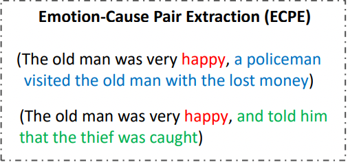
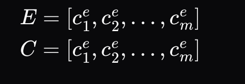
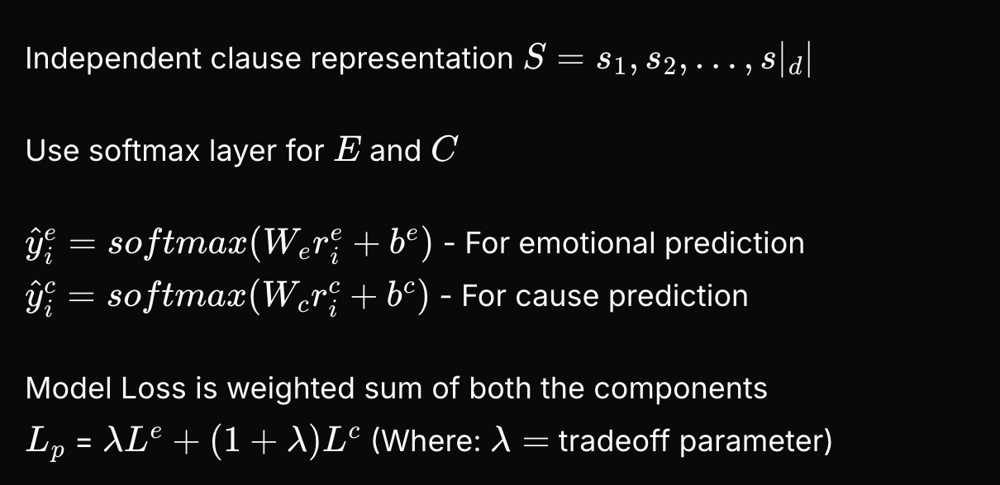
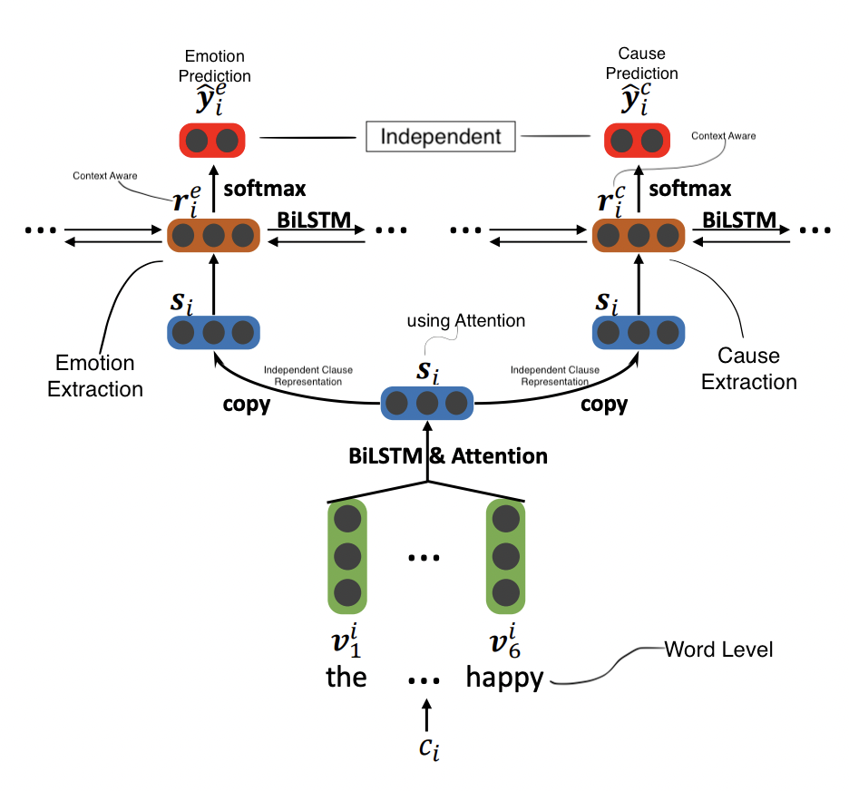
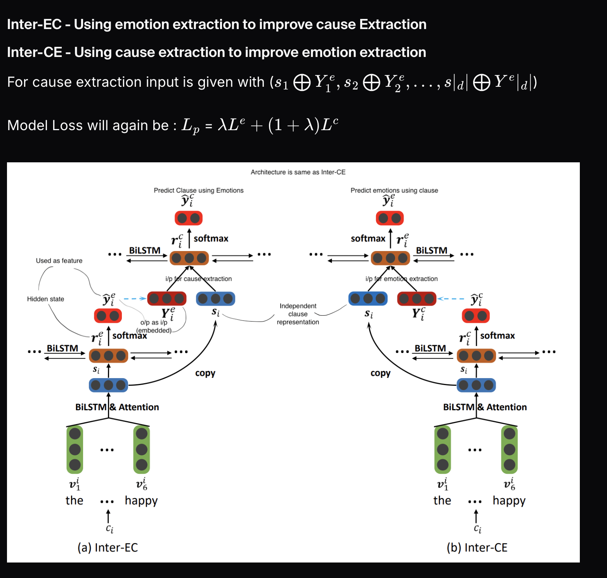
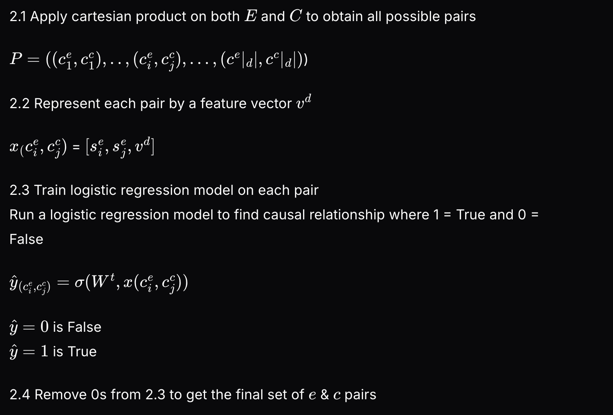

After wrapping up our NLP project as part of regular weekend meet, my friends and I decided it was time to take the plunge into state-of-the-art AI/ML topics and look at some advancement in this field.

Idea was to choose one research paper , understand the scope, problem it is trying to solve and look at proposed architecture for our implementation. Our objective was to **LEARN** and have **FUN** along the way.

Paper published in arxiv.org was selected called as [Emotional Cause Pair Extraction (ECPE)](https://arxiv.org/pdf/1906.01267.pdf). 

`Note: Images used are from this research paper, and credit goes to the authors. I have just added few annotation on top of it for better understanding.`

# Prerequisites

The prerequisites for understanding the research paper is to have excellent knowledge of the following architecture and why they took the decision to go with certain implementation.
 
- RNN (Recurrent Neural Network)
- LSTM (Long Short Term Memory)
- BI-LSTM (Bi-directional LSTM)
- Attention Model

APIs are provided by Tensorflow & Pytorch to implement these in just few lines of code but our suggestion is to try to understand through [1st principles](https://en.wikipedia.org/wiki/First_principle#:~:text=In%20philosophy%2C%20a%20first%20principle,to%20as%20postulates%20by%20Kantians) and then build some of them from scratch (using python). This will give in-depth understanding and intuition of how and why the authors have developed the system the way it is.

`Pro tip : You will quickly start going down the rabbit hole as each topic is pretty big in itself. But if you have the passion, you will get through it. Remember - it is no magic but brilliant use of mathematics`

# Overview

Emotional Cause Pair Extraction (ECPE) - Objective is to extract potential causes that lead to emotional expression in a sentence 

**Input** - Sentence with 5 clauses :-

**Output** - Emotions and Cause pair

# High Level 
The paper proposes to extract all potential pairs of emotions and and corresponding causes in a document via two step process.

`Tip: AI and ML are math heavy. Treat it like any other programming language. It takes time to learn. Math is the language of the universe and that was my motivation to learn it. What's yours? `

### **Step 1** - Extraction 

Extraction of individual Emotion \\(E\\) and Cause \\(C\\) from a document can be achieved by either of the two approaches :-

1.1> Independent Multi-task learning network

1.2> Interactive Multi-task learning network (enhanced version)

`Tip - Learn LaTeX, your friendly neighbourhood high quality typesetting system for writing Technical or Scientific documents`

Finally, the o/p of step 1 is   

### **Step 2** - Pairing and Filtering 

There are 4 sub tasks under this :-    

2.1 Apply cartesian production on all possible pairs - \\( E \times C\\)   
2.2 Represent each pair  by a feature vector   
2.3 Build a logistic regression model on each pairs  
2.4 Remove 0s from the previous steps to get the final set of \\(e\\) & \\(c\\) pairs   

# Details

Let us get into a bit more details of ***Step 1***

### 1.1>  Independent Multi-task learning network.  

Below diagram shows some of the components. 

Where:  

### 1.2>Interactive Multi-task learning network  

Below is the enhanced version where the correlation is captured between \\(E\\) & \\(C\\). There are couple of methods here but the architecture remaining the same with slight variations.

#### Inter-EC - Using emotion extraction to improve cause Extraction
#### Inter-CE - Using cause extraction to improve emotion extraction

Moving on to ***Step 2*** :-  

# Settings

We have made some modifications to the settings.  

1.  Word2Vec for word embeddings
2. Used both uniform distribution and Xavier for initialization
3. Mini batch Gradient Decent, Adam optimizer and LR set as 0.0001
4. Dropouts with regularization at 20% and 30%

# Next steps

In the next article, we will take a look at the implementation using Pytorch.

`Pro Tip - Use Pytorch (by FaceBook) if you are into research and use Tensorflow (by Google) if you are in real world implementation - though these differentiation is thinning very quickly`

# Conclusion
If you find this article useful or have any inputs, do reach out to me at [Linkedln](https://linkedin.com/in/idinc) and follow me on [Twitter](https://twitter.com/rvbugged). Thank you, keep learning!

# References

Original Paper - (https://arxiv.org/abs/2103.01544) 