# Introduction

This is the first article of a multi-part series on building Recommendation Systems (RS). 

In Part 1, we will cover the two types - Popularity Based and Content Based recommenders. Objective of the article is to share my learnings and experiences using a public dataset.

<!-- truncate -->

---
# What are Recommendation Systems
---
It's a **Information Filtering** system for providing relevant suggestions to users based on their interactions.  It aids our decision making process, things to buy, movies to watch, out of billions of items out there.  

It is perfected by Google, Amazon, Netflix and many other companies. They use various user features (location, demographics, etc) and item features (video length, type etc) to understand user preferences and made billions of dollars perfecting this system.

For example, you open your music app like Spotify and listen to a song  *`Wasted Years`* from **`Iron Maiden`**. It understands your taste in heavy metal music, uses NLP to process lyrics, calculates song's acoustics and assesses your mood to recommend similar songs. The more you interact, the perfect it becomes!

I have often heard of people spending hours watching funny or cat videos , recommendation is to blame isn't it :) .

---
# Prerequisites
---
- Dataset used - [TMDB 5000](https://www.kaggle.com/datasets/tmdb/tmdb-movie-metadata?select=tmdb_5000_movies.csv) because it is easier to relate. You can choose any dataset to implement these systems.
- It is the almost perfect publicly available dataset as using the real world dataset is not possible.
- In real world, the data needs to go through lot of clean-up process (preprocessing stage). 
- Great deal of time needs to be spent on understanding the data via Exploratory Data Analysis (EDA) & Feature Engineering (FE)  
- If you do not want to install any tools on your machine, you can use either :
    - [Kaggle](https://kaggle.com) - This is where most action happens in the world of  ML
    - [Google Colab](https://colab.research.google.com/)  - Google gives you free access to CPU and GPU
- If you are building a real world application - using an IDE (VS Code or Pycharm) is a good option.   
`Tip: Here's link to my blog on structuring real world ML projects` - [link](https://rvbug.hashnode.dev/ml-cookie-cutter)

--- 
# Dataset 

This dataset contains two files which are merged into one DataFrame (Pandas data structure).

- Movies - Details of movies like title, id etc
- Credits - Details of Cast, Crew and other metadata info

The below image shows the columns available and its data types -`df` is a dataframe

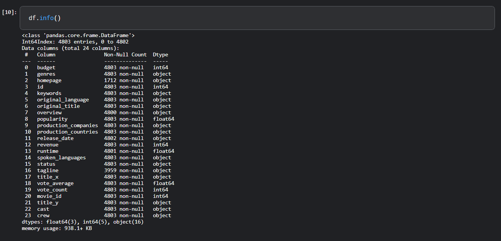

`Tip: EDA and FE takes up around 80% of your time, this is to understand the data and what story is it trying to tell`
> Become one with the data, my friend... 

---
# Types 

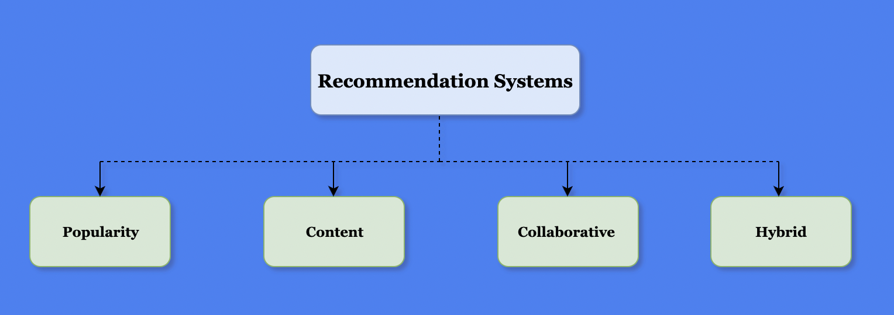

---
## A>  Popularity Based

This is a formula based recommendation system and implementation varies from company to company. Few articles classify this type as part of Collaborative filtering but I like to keep it separate.

In [IMDB](https://www.imdb.com/chart/top/), the movie ratings are not just simple average ratings given by casual users, but it takes into account `weights`  i.e. users who are industry professionals, or who has provided more than 50+ ratings. 

`Tip - Data Science and ML is more of an art than science. The implementation can vary depending on what problem are you trying to solve`

The formula used for calculating the ratings \\(W\\) is as follows:-

 Where:  
\\(R\\) :- Average rating of a movie (Ranges from 1 to 10)  
\\(v\\) :- Number of votes  i.e. how many users have given rating for a movie  
\\(m\\) :- Minimum votes required to be listed (more than 70 Percentile)  
\\(C\\) :- Mean votes for entire dataset    

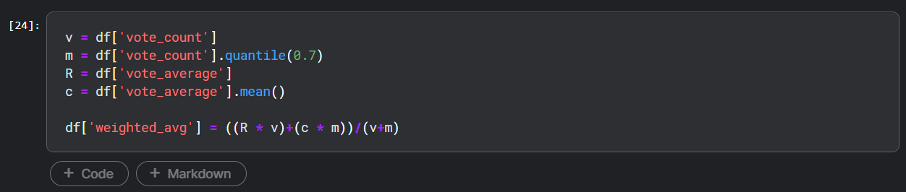

This column is now available  showing weighted average ratings.

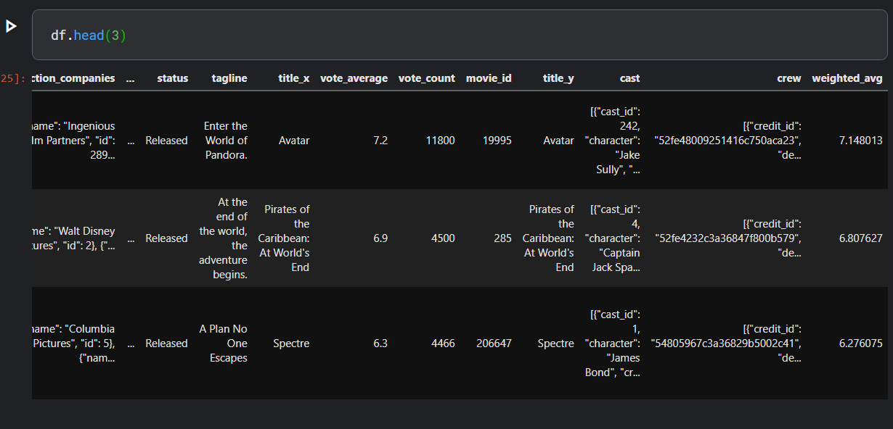

For YouTube, Twitter and other similar platforms, the implementation might be quite different - it could be based on likes, views, time spent and many other factors.

`Pro Tip: In one of the project I had to derive a method to calculate popularity.`

If you sort this weighted average in descending order and pick the first 20, here's what you will get.

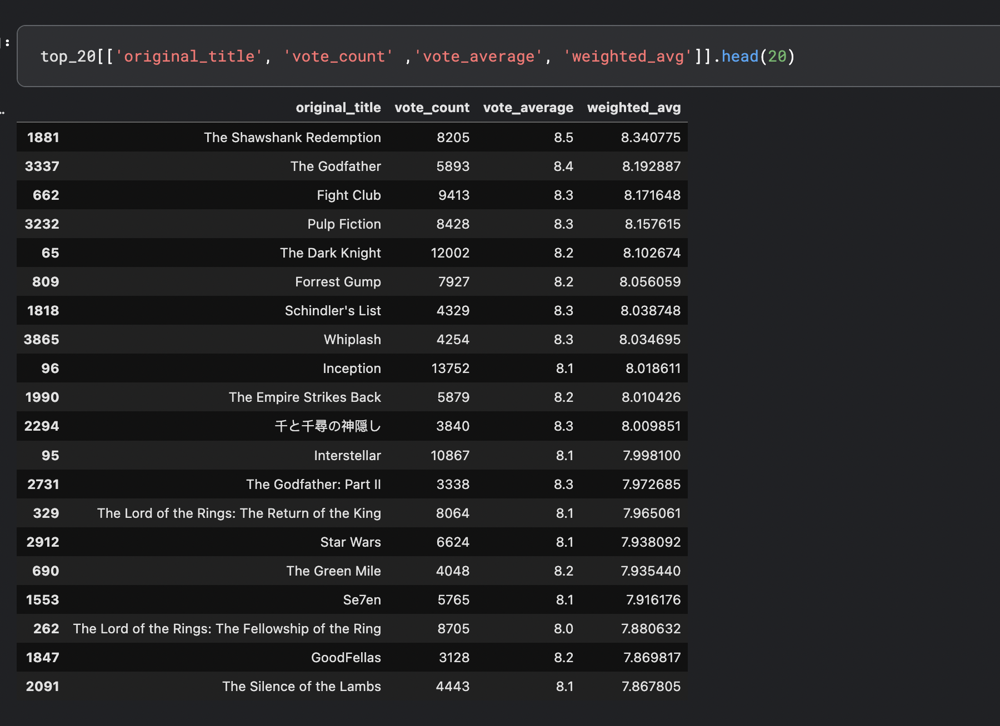

`Note: In this dataset, there is an additional column called popularity, you could also sort the ratings according to this field and have a mix of both weighted average and popularity score. In real world, this field might not be available so you will have to come up with your own calculations.`

Image below shows the popularity which is not sorted yet

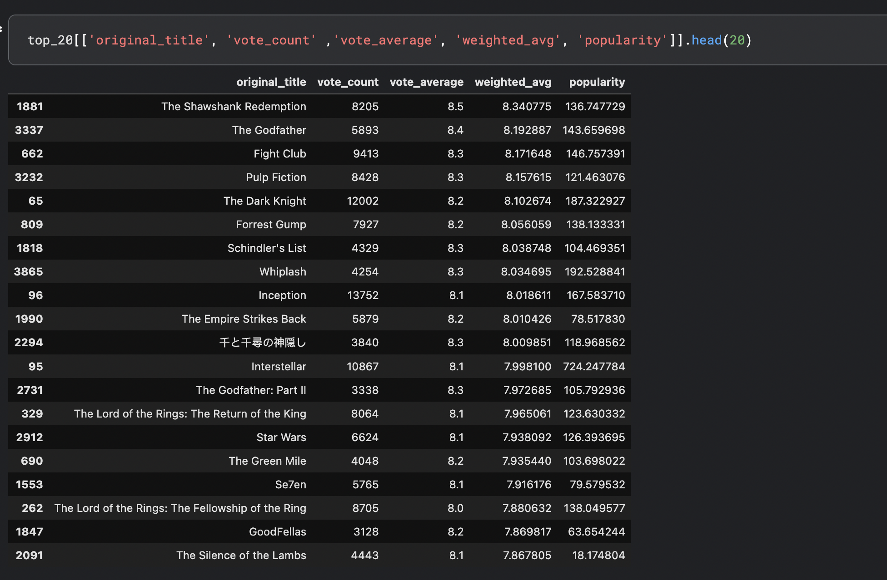

`Pro tip: The scale of weighted_avg and popularity column is  different, so transformation is applied to bring them down to same scale using - ` [MinMaxScaler](https://scikit-learn.org/stable/modules/generated/sklearn.preprocessing.MinMaxScaler.html)

MinMaxScalar normalizes the features and transforms the numbers between \\([0, 1]\\) using the formula:-

Where :  
\\( x_n\\) = Minimum value of x    
\\( x_m\\) = Max value of x    

The last two columns are now scaled. 

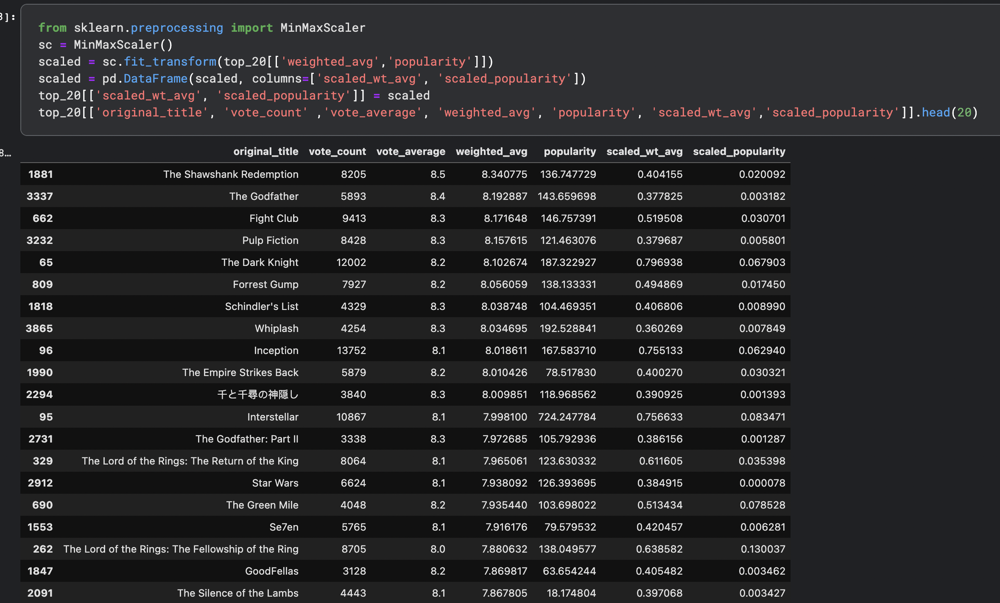

This scaled columns can then multiplied by a factor depending on your requirements. 

For example, multiply a factor of 0.4 (40%) on popularity and 0.6 (60%) on weighted_avg to extract the top 20 list again. You can even keep it equal on 0.5 (50%) each.

`Note: Depending on your application and requirements, you can show top five or ten items too`

When a new user logs in to your application, their preferences are unknown - this is called `Cold Start` problem so showing most popular items in your application the very first time they visit will get the interaction started.

---

## B> Content Based Filtering

It is a form of filtering for recommending items to a user based on their past interaction with similar items. We will talk about calculating `similarity` shortly!

Let us take our movie dataset  - if the user has watched `Inception` then based on the data available about the movie e.g. director, cast, plot, keywords and crew, you can filter similar movies and recommend them. i.e. similarity is based on metadata of the item. 

Here is the what the data shows for Inception :-

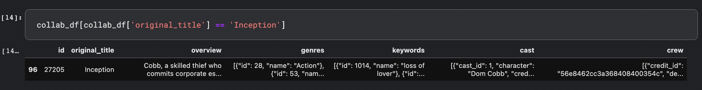

---
### Features

We will be selecting only few columns. You can always add other features like budget, release_date, runtime, tagline etc to see how your model is performing.  

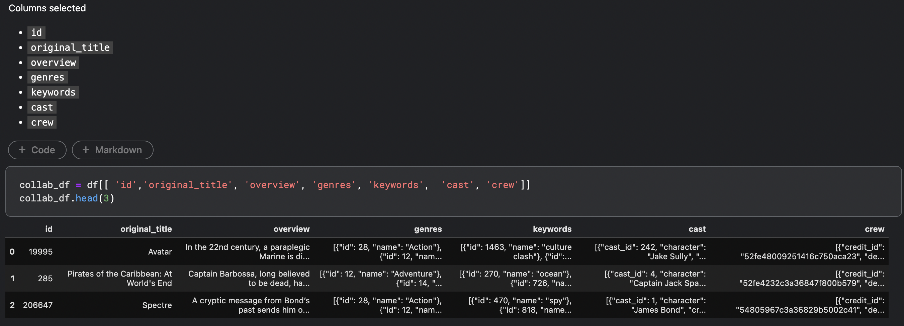

---
### Data Review
Let us review the data in each of the columns like below.

1st movie in this dataset is `Avatar`

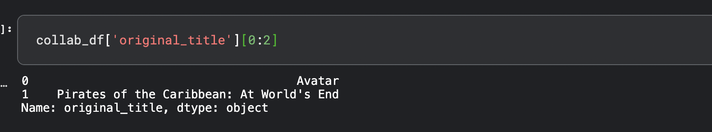

Genres :-  

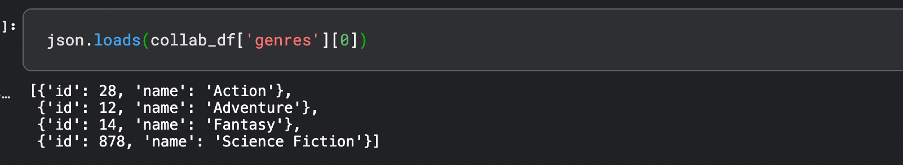

Keywords :-  

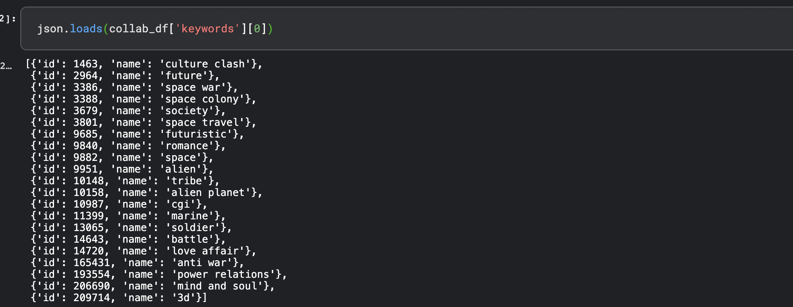

Crew details are as shown below but we will extract only Director from this list

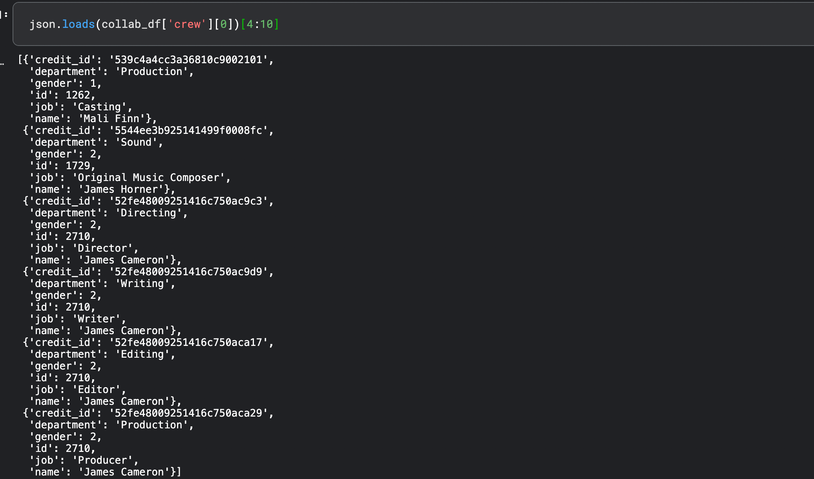

`Pro Tip: What you select as a feature depends on the problem and the data available, you might have to create a new feature based on the existing ones or transform certain features too`

---
### Processing
Next step is to process the data and create a list. We will create a function to process genres, keywords, cast and crew. For crew column, extract only job role as director. 

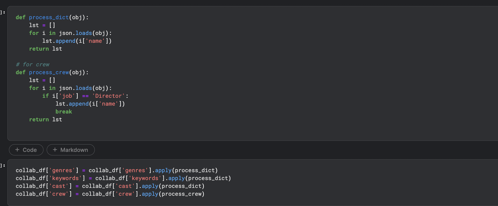

There are few additional steps to be done :-

- Drop and keep only relevant columns 
- Remove spaces from cast and crew
- Concatenate all fields except cast and crew
- Convert to lowercase
- Finally, remove stopwords 

After processing the dataframe will look something like this.
[text](img/head.png)

Sample data :-

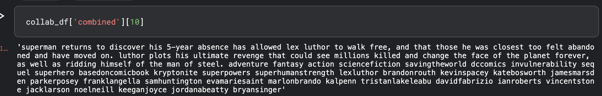

This was the easiest part :)

---
### Text Vectorizer

We went through lot of preprocessing steps in the last section to extract strings.  Strings will be converted into vectors - a step known as `Text Vectorizer`. Closer these vectors are to each other in a multidimensional space, the more similar they are. Some of the techniques to convert are :-

1. Bag of Words(BoW)
2. TF-IDF
3. Word2Vec

We will use Tf-IDF in this article.

### TF-IDF

Term Frequency Inverse Document Frequency or TF-IDF is a statistical method widely used in Information Retrieval systems and also to rank the relevance of documents in search engines.

It gives importance to a word which occurs most frequently in a document and frequency of this same word rarely occurring in an entire corpus - A kind of a push-pull mechanism. You can read more about it [here](https://en.wikipedia.org/wiki/Tf%E2%80%93idf) 

---
### Similarity

Once you have the data in a vectorized format, next step is to calculate the distance of every movie with each other. This can be achieved either by  

- Euclidian Distance  - It fails in a very high dimensional space. 
- Cosine Distance - Calculate angle between the movie vectors. Movies will be similar if the angle between them is similar.

Use sklearn's [cosine distance]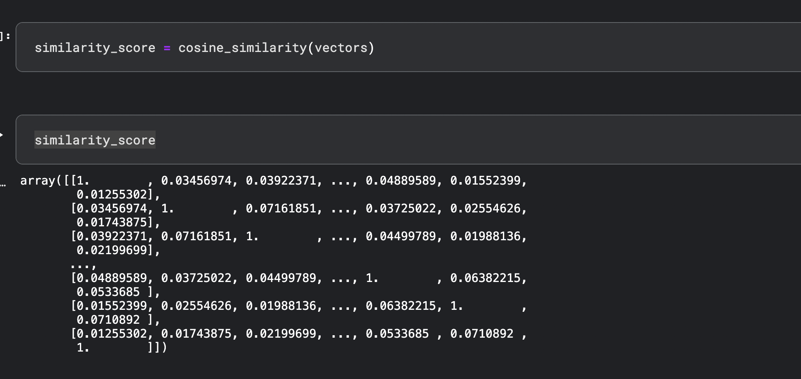

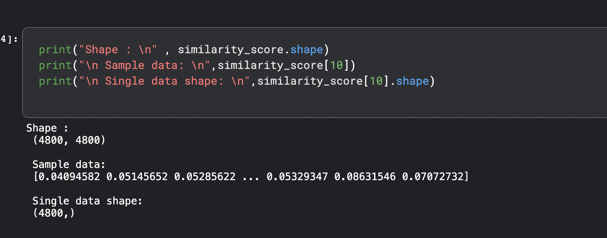

`Pro-tip: These libraries are designed to make our life easy - but understanding how and why it works at an intuitive level will help you pick up more complex and state-of-the-art implementations as you move forward in your ML jouney`

This is how the data looks :-

- Shape is 4800 x 4800 - calculate the similarity of every movie with every other movie
- Sample record - Shows 10th Record which has shape of 1 row with 4800 columns-

---
### Recommendations
Here's the function to recommend movies. 

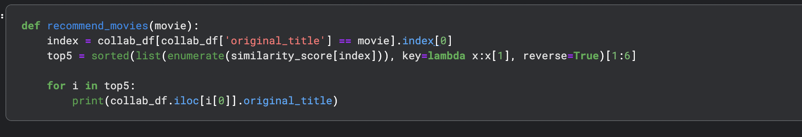

All set! Let's see how the model performs. 

Searching for Batman

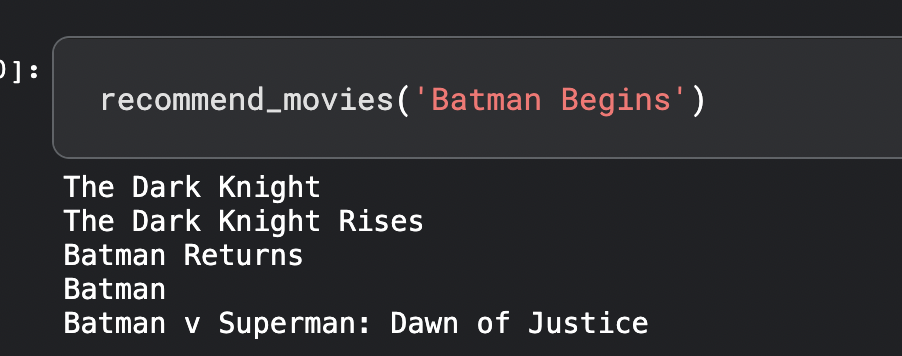

James Bond

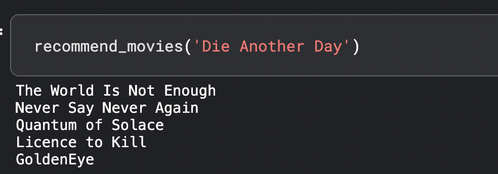

Testing on couple of my favorite movies : 

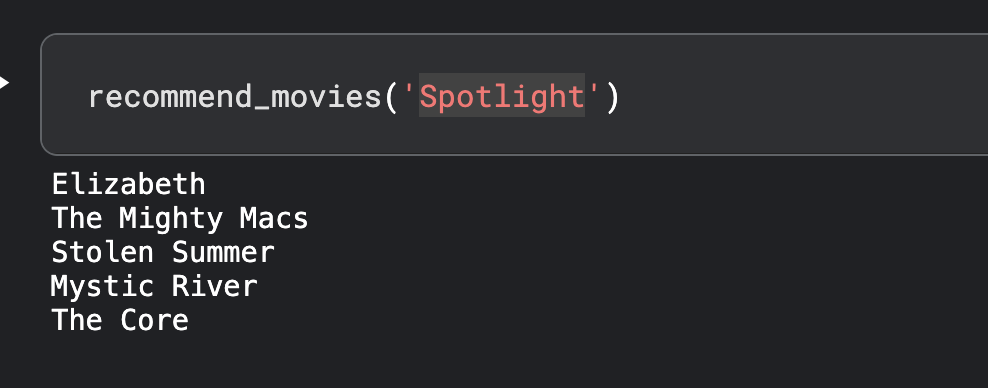

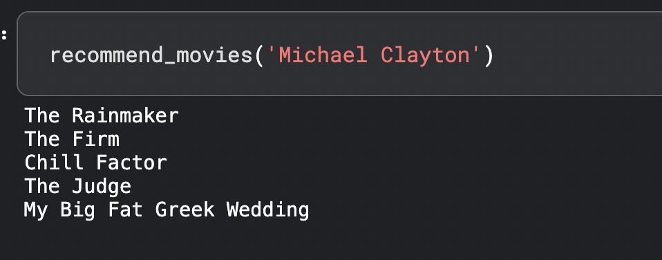

Seems to be pretty decent. You can also use additional metadata or try Word2Vec to see how accurately this model performs. 

---
# Conclusion
  
In this article we covered what are Recommendation Systems, their types, looked at Popularity and Content based systems. In the next article we will take a look at most widely used Collaborative filtering. Stay tuned!!

Credit goes to amazing people who have been patiently answering my questions and publishing some great content out there from where I learnt so many things. 

You can download the dataset [here](https://www.kaggle.com/datasets/tmdb/tmdb-movie-metadata)

Code is available at :
  
[Github](https://github.com/rvbug/RecommendationSystems)       
[Kaggle - Content Based](https://kaggle.com/rvbugged/content-based)   
[Kaggle - Popularity Based ](https://kaggle.com/rvbugged/popularity-based)     

You can find me on [Linkedln](https://www.linkedin.com/in/idinc/) and [Twitter](https://twitter.com/rvbugged).