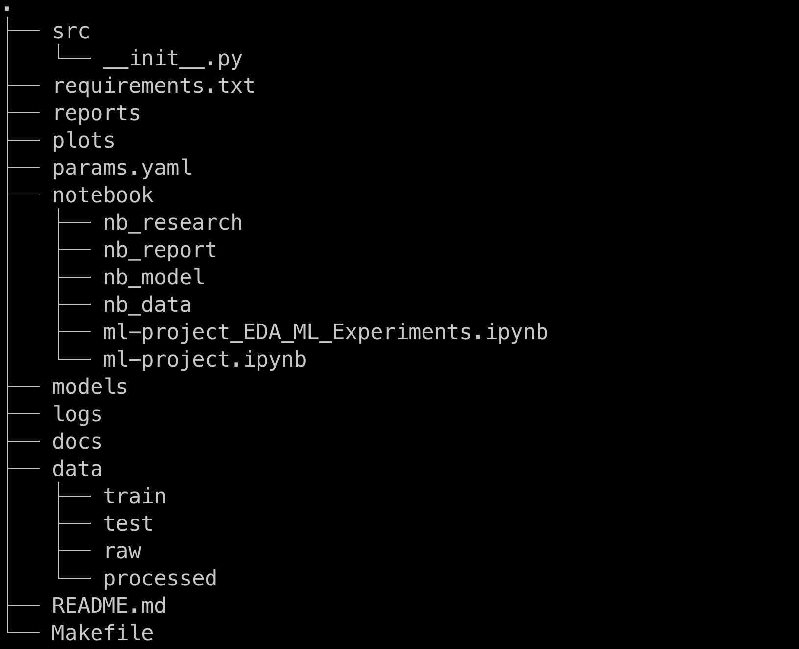

Couple of years back, I wrote blog on how to :

1&gt; Structure your Data Science and ML project - [Link here](https://rvbug.hashnode.dev/structuring-data-science-and-ml-projects)

2&gt; Automating ML structure using `Make` and a simple `Python Script` - [Link here](https://rvbug.hashnode.dev/ml-cookie-cutter).

In this follow-up article, I will provide an update to the cookie-cutter project which now uses `yaml` making it far more flexible and easy to use.

# Project Structure

Here's the structure I use for all my ML projects.

You can create a different one but these are pretty standard for most of the projects.



## YAML

YAML is **a text based data serialization language for managing your configuration files**. YAML stands for `Yet Another Markup Language` or `YAML ain't markup language`. You can read more about it [here](https://en.wikipedia.org/wiki/YAML).

Here's the YAML format used in my project.

```yaml
  # support for data version control
  - .dvc:

  # if you plan to use docker container
  - docker:
    - Dockerfile

  # basic ML development files
  - src:
    - __init__.py
    - data_pipeline.py
    - data_processing.py

  ####
```

# Script

One of the main pre-requisites for this script is `pyyaml`. You can find the documentation [here](https://pyyaml.org/wiki/PyYAMLDocumentation). Install them via [pip](https://pip.pypa.io/en/stable/).

## Argparse

Everything starts with the main function. It uses argparse to parse command line arguments provided to the script. It then loads the yaml config file.

```python
# parse the arguments provided on the command line
args = parse_args()

# Load yaml config
config = load_config()
```

The parser will look for specific flags and take action. More about that in the Help section below.

```python
parser.add_argument("--n", "--name", #...)
parser.add_argument("--p", "--path",  #...) 
parser.add_argument("--c", "--config",  #...)
parser.add_argument("--v", "--venv",  #...)
```

## File and Directories

Based on how YAML is structured, the script will create files, directories and sub-directories via a function `create_directories`

```python
def create_directories(project_path, config):

if isinstance(config, str):
        item_path = os.path.join(project_path, config)
        with open(item_path, "w"):
            pass  # empty file

#...
```

## Virtual env

If you provide flag to create a [virtual environment](https://docs.python.org/3/library/venv.html), the script will create one for you. There is a function called `create_virtual_env` to do exactly that.

```python
def create_virtual_env(project_path, activate=True):
#...
if not os.path.exists(venv_path):
        venv.create(venv_path, with_pip=True)
#...
```

## Help

When you use `-h` flag, it will show you how to use the script.

If you want to give a specific name to your project use `--n or N` flag. If not, it will create a default directory called `ml-cookie-cutter.`

Specify the path where the project needs to be created using `--p or P` flag.

Finally, if you want the script to create a virtual environment for you, go ahead and use the `--v or --venv` flag. By default, the name of the environment is `venv`.

```bash

$> python3 main.py --h

# usage: ML Cookie Cutter [-h] [--n N] [--p P] [--c C] [--v]

# Creates ML project cookie cutter structure

#optional arguments:
#  -h, --help       show this help message and exit
#  --n N, --name N  Name of the directory to be created, default = ml-cookie-cutter
#  --p P, --path P    provide the path where, default is $HOME dir
#  --v, --venv        create a virtual env. [ignore if you are already on a virtual env]

# Enjoy and happy coding
```

## Final step

Once you have the virtual environment set up, you can activate it as shown below. You should see that it in your command prompt; go ahead and start installing all your Data science and ML libraries.

For deactivating simply type `deactivate`

```bash
# go to the project folder
$> cd ml-cookie-cutter
# activate the environment 
$> source venv/bin/activate 

# venv is activated 
(venv) $> pip install numpy pandas pytorch seaborn notebook

# To deactive use the following command
(venv) $> deactivate
$>
```

On windows if you use PowerShell activate using `Activate.ps1`

# Conclusion

This article shows how you can use this cookie-cutter project and create a ML structure with a simple command-line tool. Enjoy and have fun learning!

This is how I have used the cookie-cutter project to create a ML structure with a simple command-line tool. Enjoy and have fun learning!

Happy coding!

# References

[Github - Complete Code](https://github.com/rvbug/cookie-ml/)

[Pyyaml Documentation](https://pypi.org/project/PyYAML/)

[Installing Python](https://www.python.org/)

[PIP Installation](https://pip.pypa.io/en/stable/)

[How to structure your ML projects](https://rvbug.hashnode.dev/ml-cookie-cutter)

[Automating ML structure (v 1.0)](https://rvbug.hashnode.dev/structuring-data-science-and-ml-projects)

[Documentation on Virtual Env](https://docs.python.org/3/library/venv.html)