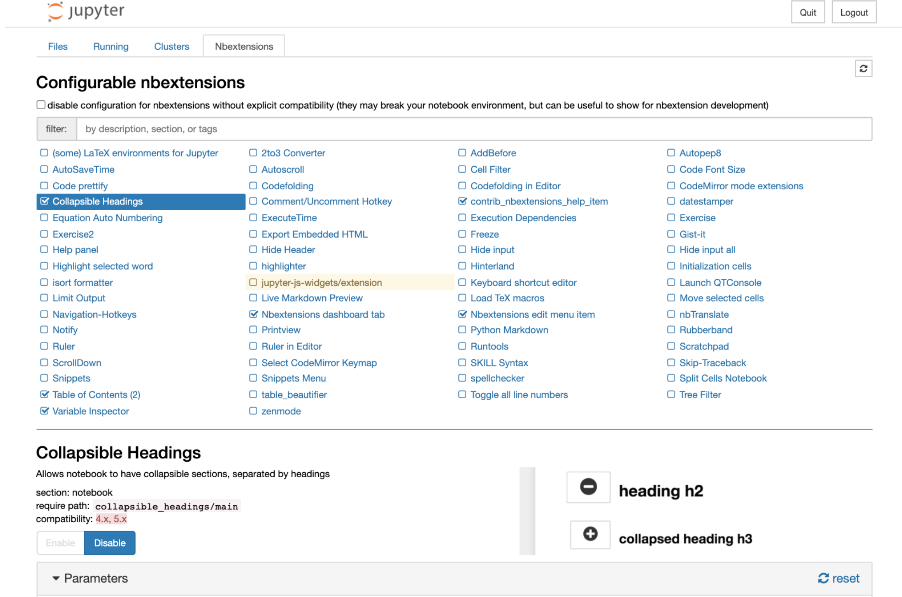
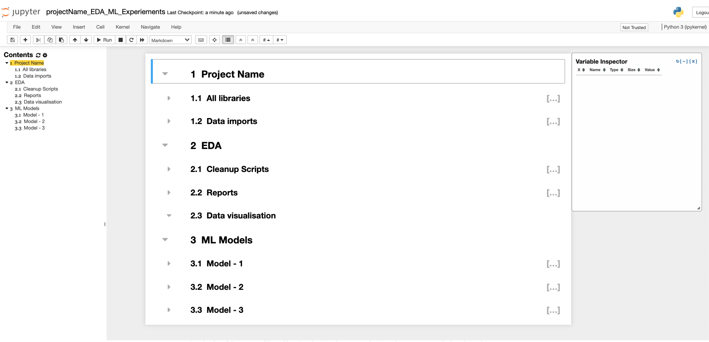
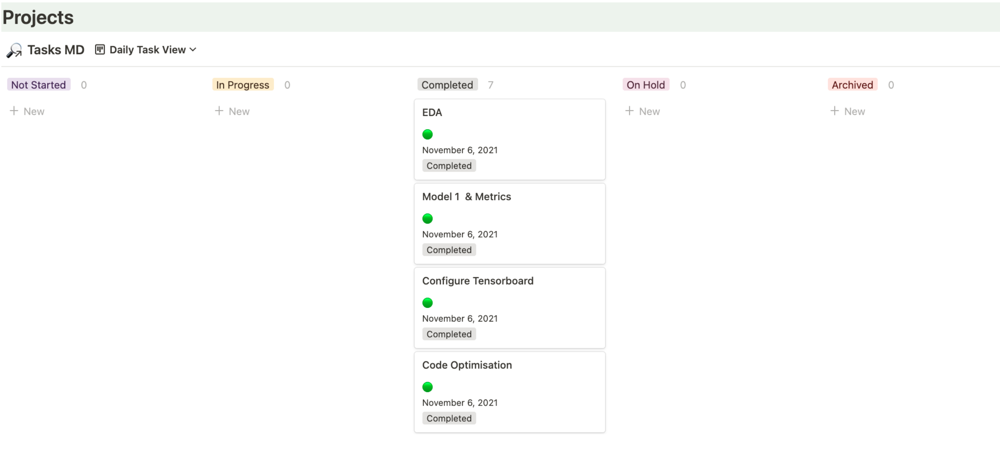

# Tools

You can choose from a variety of IDE/tools out there but it all comes down to your preference and taste. Some of them are…

- **PyCharm**
- **Spyder**
- **Jupyter Notebook**

If it is your personal project, you can use Google  [Colab](https://colab.research.google.com)  — This gives you free access to GPUs and TPUs (Tensor Processing Units). Jupyter even works well for learning programming language like Julia.

To track your tasks, you can use any project management or Kanban tool like  [Trello](https://trello.com/)  (easy to set up) or  [Notion](https://www.notion.so/)  (needs time to set it up but extremely effective).

# Structure

You need to first install Python and Jupyter notebook via `pip install jupyter`. You can skip this step if you have already installed them.

Once installed, you can add additional configuration by installing NBExtensions using `pip install jupyter_contrib_nbextensions`.

Now, when you start Jupyter Notebook, you should see nbextensions Tab like below.

These are the ones which I use — Collapsible Headings, Table of Contents and Variable inspector but feel free to add additional extensions.

# Sample Jupyter Notebook

This is what the NBExtension selection will help you do. Create a new section using markdown and Contents gets filled in automatically. This also helps you to jump between the section while keeping the notebook clean.

# Setting up Folder Structures

Typically, my folder structure is as below — You can add more folders/sub-folders or modify it according to your requirements.

**`data`** - Stores all the data is in various formats (.json, .csv, .xlsx etc).

**`reports`** - All the reports are stored in here.

**`mode`** - If you are working on ML models, you can use this to store all your model checkpoints.

**`technicalPaper`** - Finally, technical paper (.ipynb or a word doc) to be presented to your team.

# Naming Jupyter Notebooks

I use the following names to differentiate between experiments and final code

`**projectName_EDA_ML_Experiements.ipnyb**` - All your analysis will be here. You will start exploring, understanding, cleaning up data, running your models, metrics and performance. This is your playground. During the exploratory phase, this file will be filled with lots of code, data type conversions, distributions, data transformations, plots, sample code etc. This is a necessary step to understand the data.

`**projectName.ipynb**` - Where the final code lives all cleaned up. If you want to work on additional data points, go back to the experiment notebook so you can keep this neat and clean.

`**projectName_ResearchPaper.ipynb**` - This is where I usually capture my notes, references, website and Math formulas etc. This then becomes your research/white paper to be published.

# Project Tracking

Usually enterprise level project takes much longer, it has multiple tasks which includes gathering additional inputs from Product Owners/ Business/Sales team and other stakeholders — not to mention additional rush of ideas when you are in “The Zone”

For tracking, I have experimented with couple of tools -

1> The old fashioned but effective way — Pen and Paper

2> To use some kind of Kanban tool like Trello.

But the one which is been very effective for me over the past year is an app called Notion. This helps me to view the tasks for the day, plan for the week and hit the quarterly goals.

At the end of the day when you see the status of your task as completed like below, you’d know you had a great day!!!

# Conclusion

I had done a great deal of experiments before narrowing it down to these processes, so if this article helps you in any way do let me know.

Happy Learning!!!