Modern editors work out of the box. Just install, launch and you are ready to go! But sometimes, it is slow and clunky eating up a lot of memory.

Then there are terminal based IDEs focusing on pure text manipulation. No fancy interfaces, only powered by keyboard shortcuts and macros. One such IDE is Vim (**Vi** i**M**proved)

In this blog, I have shared my Neovim setup, plugins and keyboard mappings. This configuration supports various programming languages like `Lua`, `Python for Data Science & ML`, `OCaml`, `Rust`, `Web Development`, even Notes and Journaling. Detailed documentation is available on my [github](https://github.com/rvbug/neovim).

Read on!

# Popular IDEs

Here's a 2023 stack overflow survey of the most popular IDEs. Vim is still in the top 5 considering that it was first released in 1991. ([Link](https://survey.stackoverflow.co/2023/#most-popular-technologies-new-collab-tools) to the survey)

![Stackoverflow Survey]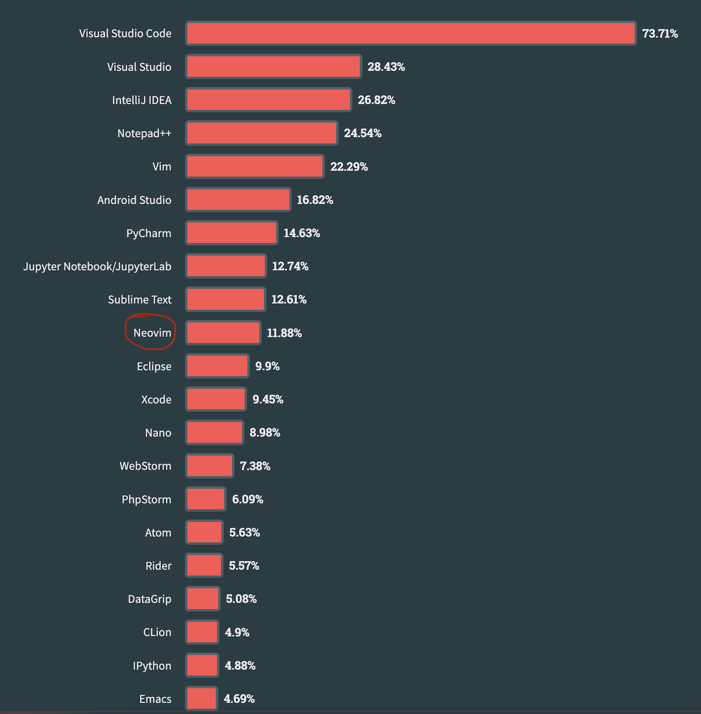

---

## Vi Improved (Vim)

Vim was created by Bram Moolenaar. A highly customizable modal, screen-based text editor written in C and Vim Script (VimL). It is known to be very fast, extremely efficient, highly configurable, supporting many programming languages and providing extensive plugin support.

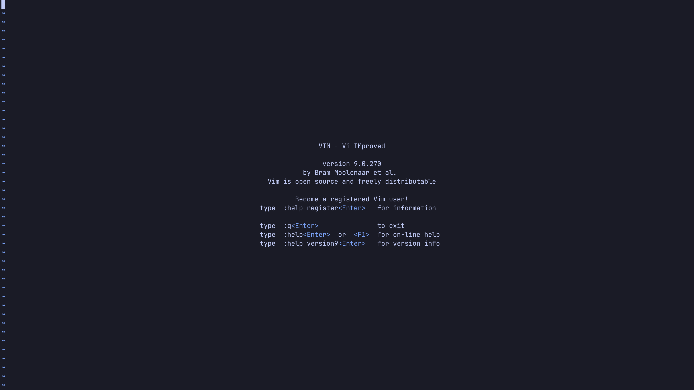

## Neovim (Nvim)

NeoVim was released in 2014 and is a fork of Vim. It uses a fast, small and lightweight scripting language called [Lua](https://www.lua.org/).

Lua supports procedural, object-oriented and functional programming. It can be embedded into C/C++ quite easily too.

The goal of this project was not to replace Vim but to extend and incorporate additional features. Almost all of the features of vim are now supported by Neovim.

`Note`: I have used Neovim and nvim interchangeably to refer to Neovim.

(This splash screen is because of a plugin called [Alpha](https://github.com/goolord/alpha-nvim))

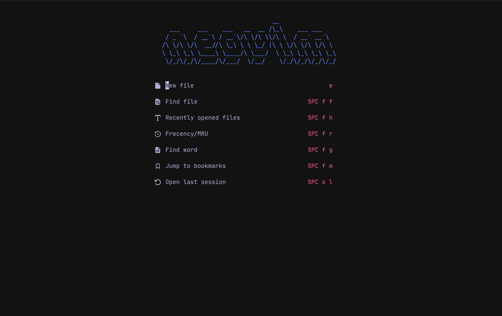

---

# Configuration

The main configuration directory of nvim is `$XDG_CONFIG_HOME/nvim/` pointing to this folder - `~/.config/nvim/`

`Note`: Lua is integrated as the first-class language for Neovim v5.1 and above.

```bash
# nvim looks for this file when it loads
~/.config/nvim/init.lua 

# if this folder and files does not exist, create them
> mkdir .config
> cd .config
> mkdir nvim 
> cd nvim 
> touch init.lua
```

## File structure

I have used [VimPlug](https://github.com/junegunn/vim-plug) and [Packer](https://github.com/wbthomason/packer.nvim) but I found [Lazy](https://github.com/folke/lazy.nvim) package manager to be well organized for my needs.

Here's how my files are structured. Anything inside of plugins folder gets called automatically. Details of these files are available on my [github](https://github.com/rvbug/neovim?tab=readme-ov-file#folder-structure).

```bash
~/.config/nvim/
├── LICENSE  
├── README.md  
├── init.lua  
├── lazy-lock.json
├── lua
│   ├── keymaps.lua
│   └── plugins
│       ├── autopairs.lua
│       ├── comments.lua
│       ├── completions.lua
│       ├── db.lua
│       ├── debug.lua
│       ├── floating-help.lua
│       ├── gitblame.lua
│       ├── gitsigns.lua
│       ├── greetings.lua
│       ├── iron.lua
│       ├── lspconfig.lua
│       ├── lualine.lua
│       ├── markdown.lua
│       ├── neorg.lua
│       ├── noice.lua
│       ├── none-ls.lua
│       ├── nvim_tree.lua
│       ├── quarto.lua
│       ├── telescope.lua
│       ├── themes.lua
│       ├── toggleterm.lua
│       ├── treesitter.lua
│       └── zen.lua
└── yarn.lock
```

# Terminal & Tmux

I use [Wezterm](https://wezfurlong.org/wezterm/index.html) terminal. It is written in rust and supports lua based configuration. [`.wezterm.lua`](https://github.com/rvbug/neovim/blob/main/.wezterm.lua) contains my basic setup.

Using Tmux (Terminal Multiplexer) helps me with multiple sessions, each with multiple windows (tabs). It even allows one to save and restore the sessions.

You can find the configuration in this [`.tmux.conf`](https://github.com/rvbug/neovim/blob/main/.tmux.conf) file.

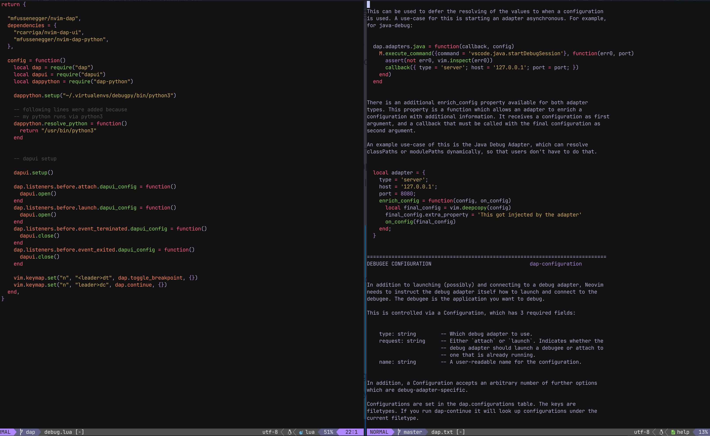

## Init file

`init.lua` is the first file that gets loaded when Neovim starts. I am loading `keymaps.lua` and Lazy package manager via this.

## Keymaps

`keymaps.lua` is where I have configured my keyboard shortcuts. Look at a few sample keybindings, these are pretty standard ones.

```bash
# global leader key is <Space> 
vim.g.mapleader = " "

# in normal mode, use <space>v or <space>sh to run specific commands 

# to split the screen vertically
keymap.set("n", "<leader>sv" , "<C-w>v")
# splits screen horizontally
keymap.set("n", "<leader>sh" , "<C-w>s")

## Telescope keymapings

# find files 
keymap.set("n", "<leader>ff", "<cmd>Telescope find_files<cr>") 
# live grep 
keymap.set("n", "<leader>fg", "<cmd>Telescope live_grep<cr>") 
# find string under cursor 
keymap.set("n", "<leader>fc", "<cmd>Telescope grep_string<cr>") 
# display list of open buffers
keymap.set("n", "<leader>fb", "<cmd>Telescope buffers<cr>")
```

## Theme

There are many color schemes to choose from, I have been using [Tokyo Dark](https://github.com/tiagovla/tokyodark.nvim) and the configuration is loaded via `themes.lua` file.

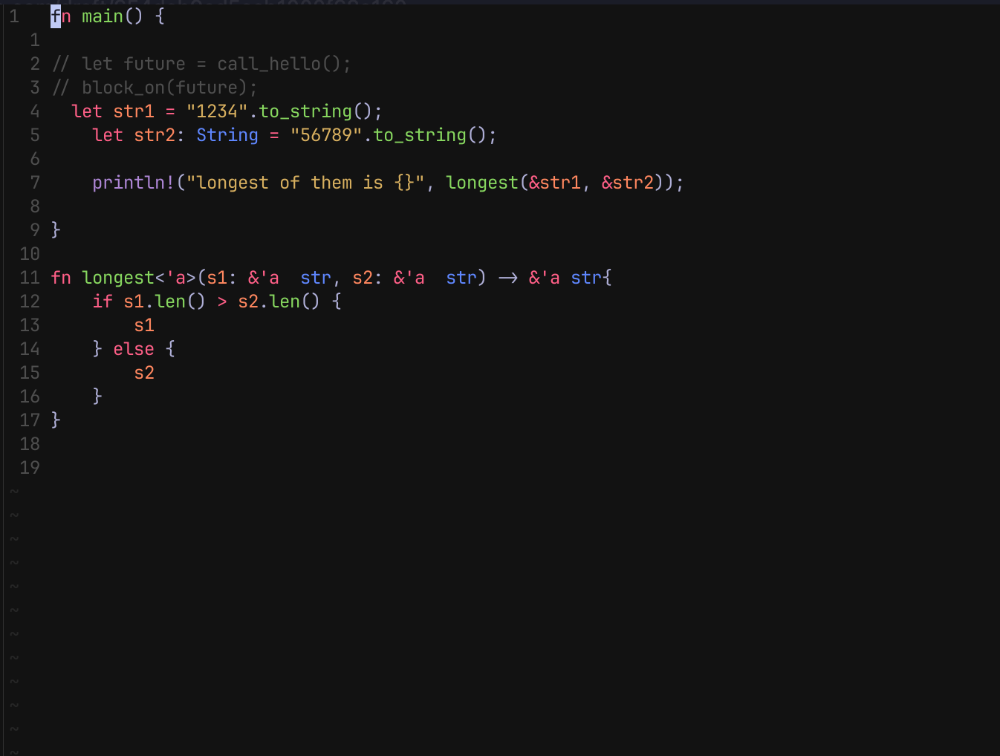

## Telescope

A fuzzy finder plugin that helps you to find files and supports live grep along with many other features.

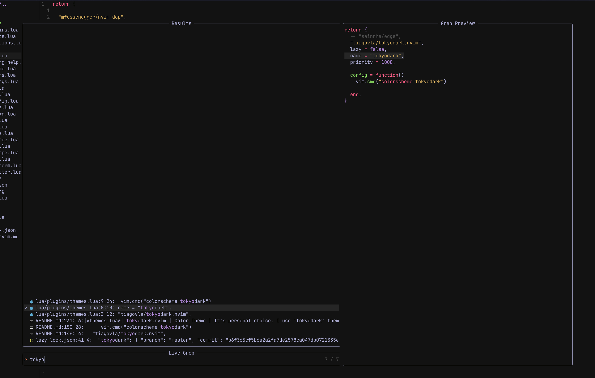

# Code Completion

`completions.lua` has the following plugins to support code completions and snippets using LSP ([Language Server Protocol](https://microsoft.github.io/language-server-protocol/)).

```bash
# client for LSP.
"hrsh7th/cmp-nvim-lsp", 
# snippet engine
"L3MON4D3/LuaSnip",
# completion source for nvim-cmp
"saadparwaiz1/cmp_luasnip",
# additional snippet support 
"rafamadriz/friendly-snippets",
```

#### ***Here's the completion and snippets for Python, Lua and Ocaml***

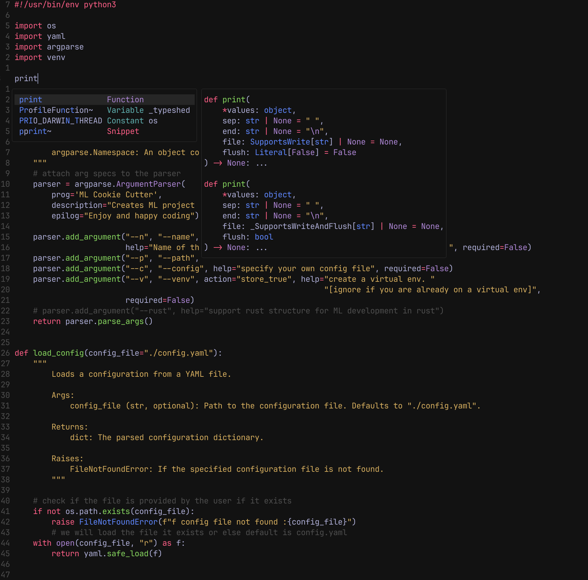
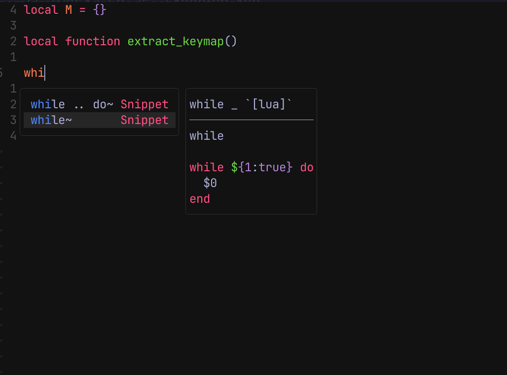
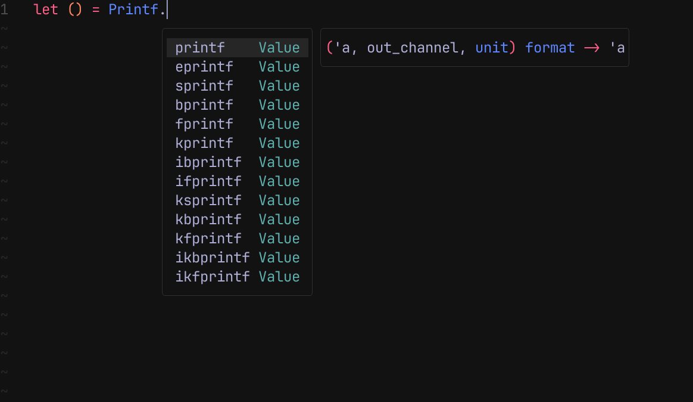

The following plugins help with path and command completion too.

```bash
# path completion
"hrsh7th/cmp-path",
# command line completion
"hrsh7th/cmp-cmdline",
```

*Path Completion*

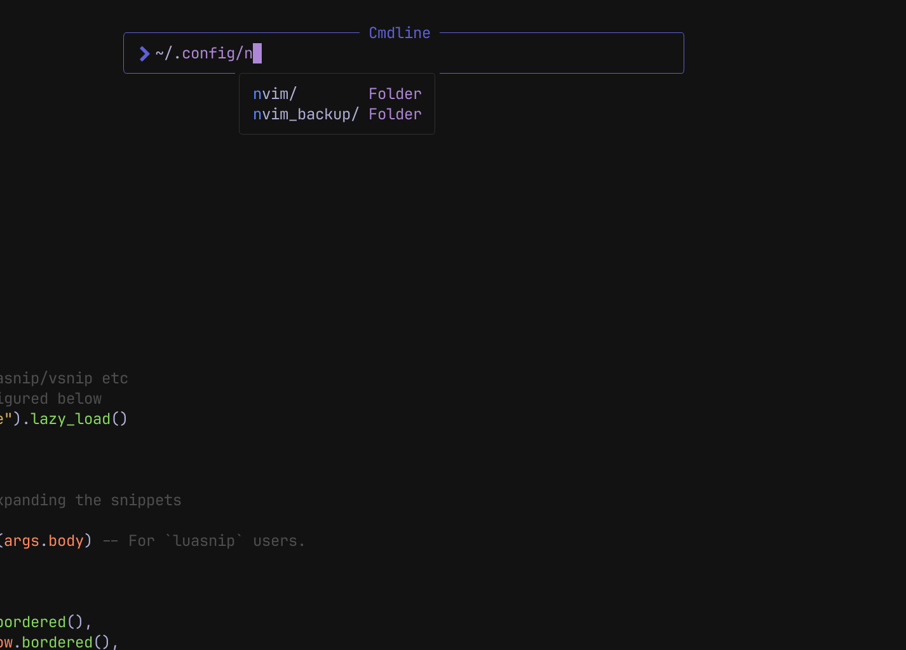

*Command Completion*

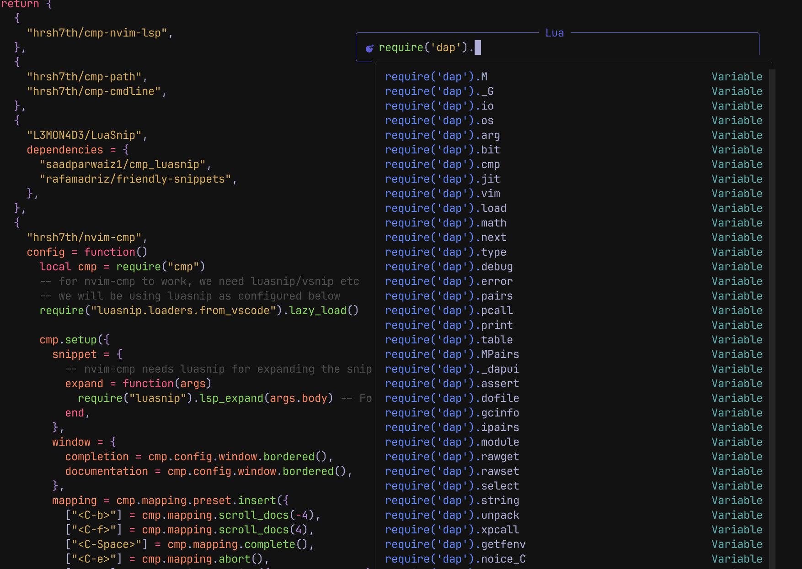

## Quarto Support

Quarto is heavily used in scientific publishing, my setup supports them.

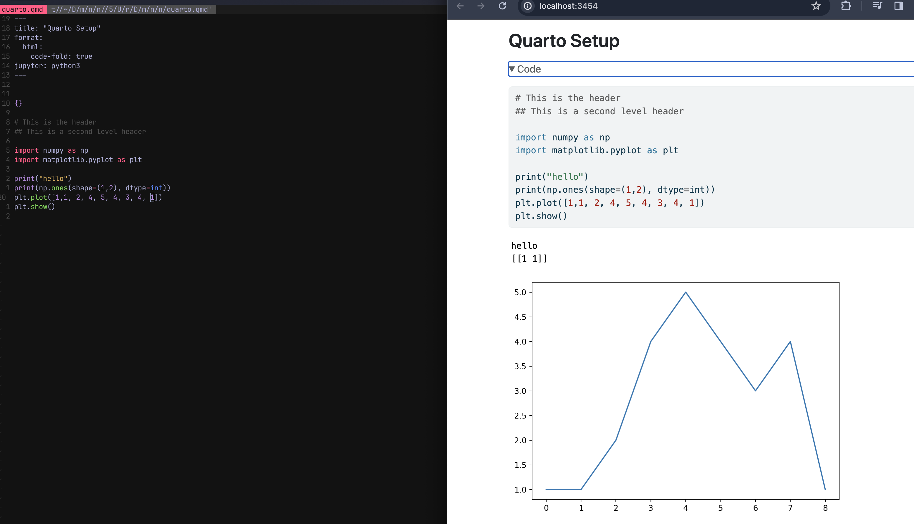

`Did you know:` Quarto also has great integration with Jupyter Notebook, see the sample below.

`The one on the left is the Quarto html format generated from the Jupyter notebook on your right.`

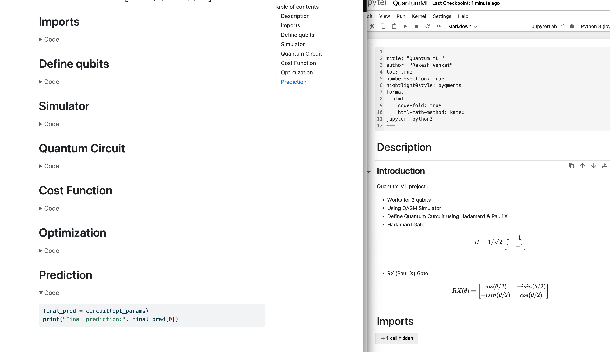

## Git Integration

For git integration I use

#### Lazygit

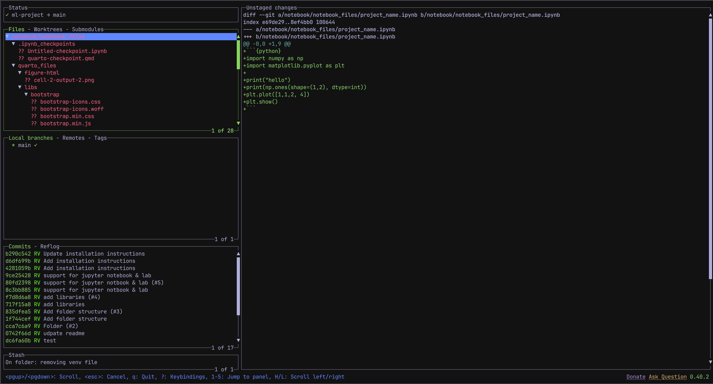

#### Gitblame

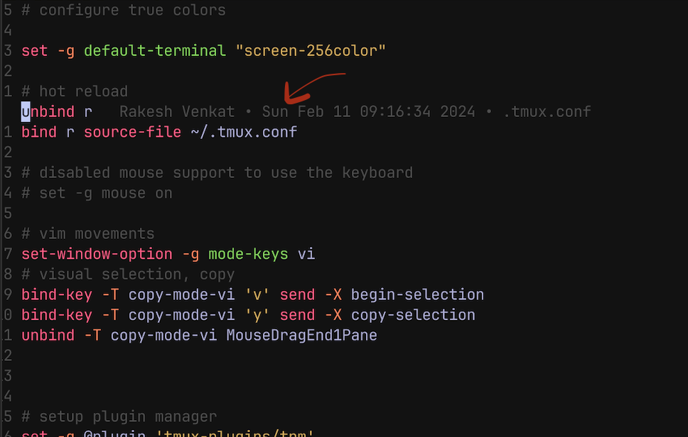

## DAP (Debug Adapter Protocol)

Showing DAP support for Python

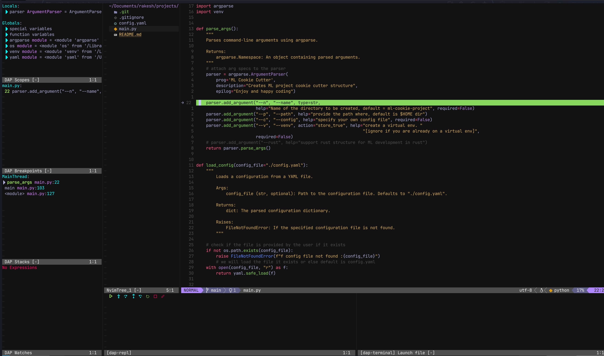

# Next steps

How do you learn Neovim, I have added the references to some amazing documentation [here](https://github.com/rvbug/neovim?tab=readme-ov-file#references). You can also get extensive help right inside Neovim.

Checkout `:Tutor`

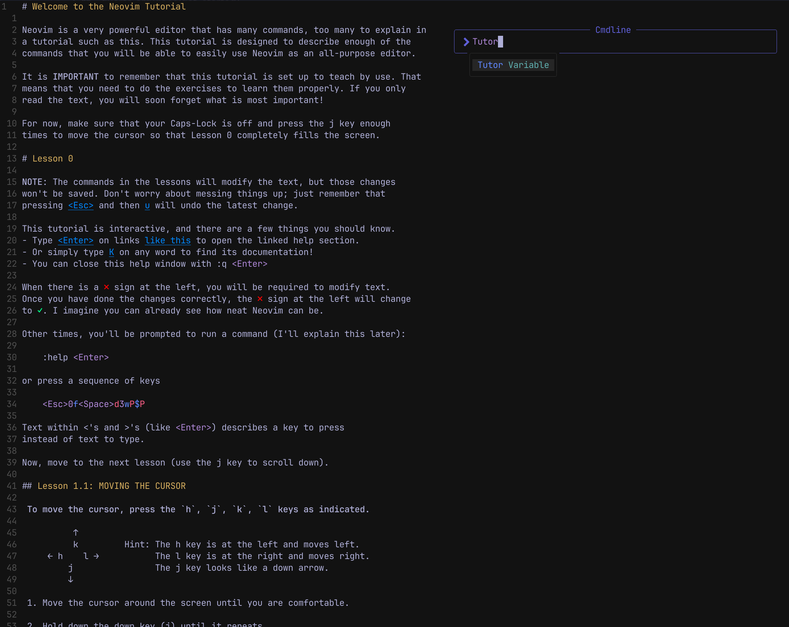

Type `:help` to show up entire documentation but you can also go to specific ones by typing `:help usr_0` or use [Neovim Website](https://neovim.io/doc/user/index.html) to read through it.


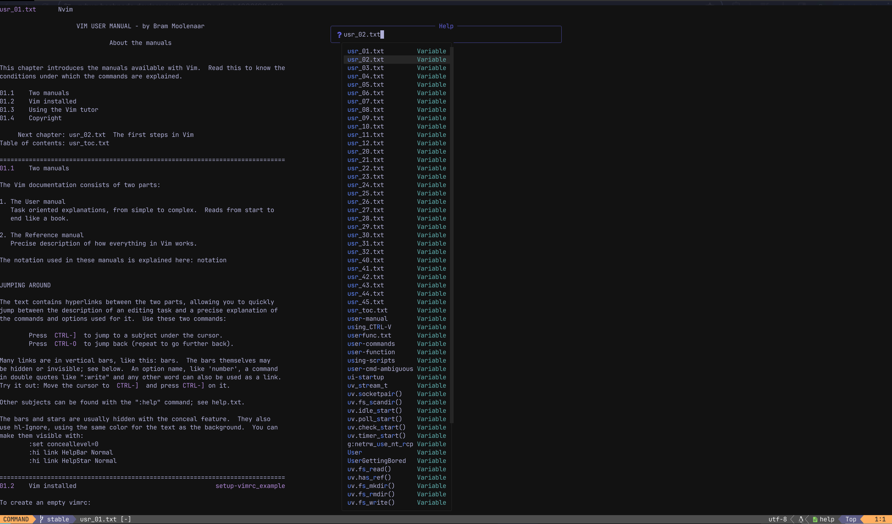

# Alternatives

If you decide to try Neovim but do not want to go through the hassle of configuring all by yourself then check out these interesting "starter kit" projects.

All these projects have extensive documentation on their website but before you try them, backup your existing nvim file under `~/.config/` folder if it exists.

```bash
> cd ~/.config
> mv nvim nvim_backup
```

### [LazyVim](https://www.lazyvim.org/)

Supports Mac/Linux based systems.

```bash
git clone https://github.com/LazyVim/starter ~/.config/nvim
```

### [NVChad](https://nvchad.com/)

To install on Mac/Linux based system, use the following command:

```bash
git clone https://github.com/NvChad/NvChad ~/.config/nvim --depth 1 && nvim
```

### [LunarVim](https://www.lunarvim.org/)

To install, use the following command

```bash
LV_BRANCH='release-1.3/neovim-0.9' bash <(curl -s https://raw.githubusercontent.com/LunarVim/LunarVim/release-1.3/neovim-0.9/utils/installer/install.sh)
```

# Conclusion

Yes, it takes time to configure these IDEs but is it really worth the effort? That is the question you need to answer for yourself. If you are unable to decide then I would suggest give it a try.

Neovim has helped me to design the workflow that I need to get to a complete 'mouse-less' environment.

Check out my [configuration](https://github.com/rvbug/neovim) and leave a comment if you have had any similar experiences. Reach out if you have any questions, I'd be happy to help!

***Happy Coding!!***

# References

[My Configuration (Github)](https://github.com/rvbug/neovim/)

[Official VI](https://quarto.org/docs/publishing/rstudio-connect.html)[M](https://quarto.org/docs/publishing/confluence.html)

[VIM](https://en.wikipedia.org/wiki/Vim_(text_editor))[Wiki](https://pandoc.org/)

[Officia](https://quarto.org/docs/publishing/confluence.html)[l Neovim](https://neovim.io/)

[Vim Cheat Sheet](https://linuxhandbook.com/vim-cheat-sheet/)

[Lua Cheat Sheet](https://devhints.io/lua)