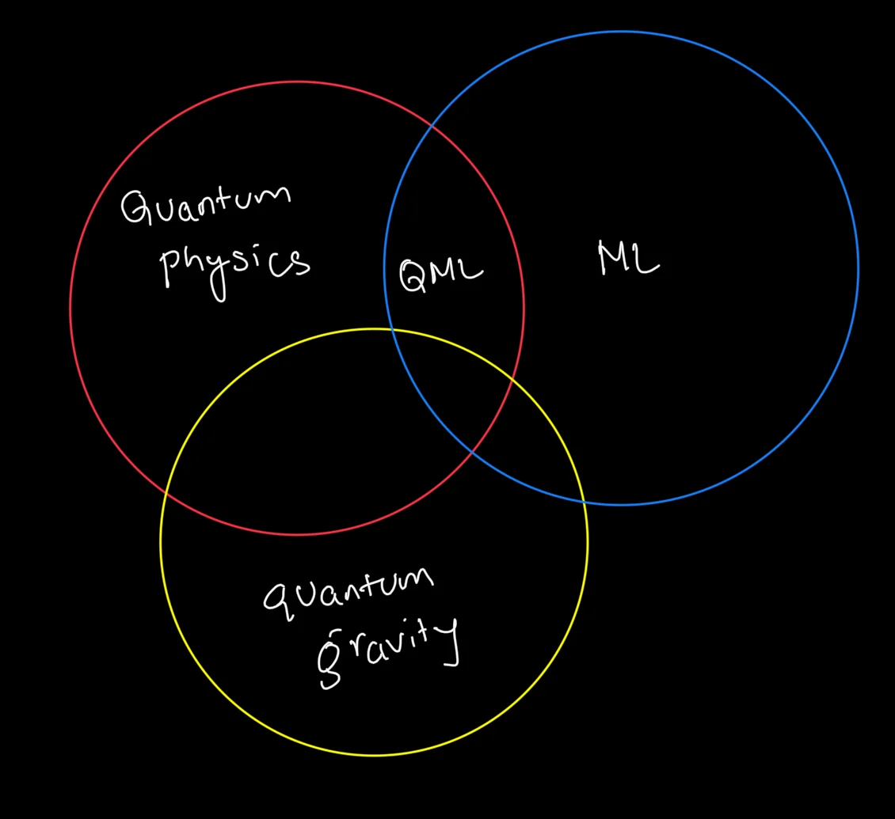
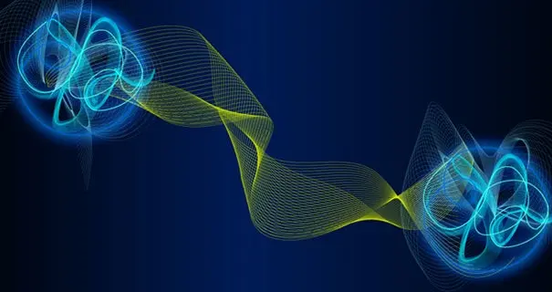
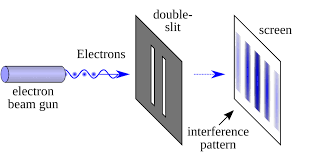
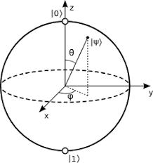
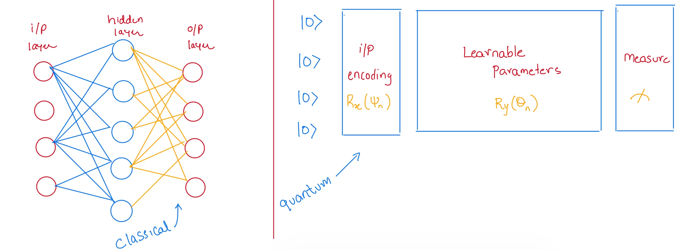

Another interesting branch gaining momentum is Quantum Machine Learning (QML) - an intersection between Quantum Physics and ML. QML can speed up training and evaluation of ML models and, in turn, help develop new quantum algorithms. This blog is an introduction to QML.





Source code provided in this article is available in my [**Github repo**](https://github.com/rvbug/q-gravity/)**.**

---

# Introduction

Rapid progress has been made in Quantum Computing to harness the law of [Quantum Mechanics](https://en.wikipedia.org/wiki/Quantum_mechanics) and the problems (NP or NP-Hard) that classical computers alone cannot solve, even with arrays of GPUs and TPUs at our disposal.

That being said, Quantum Computers is not going to replace classical systems any time soon but will coexist (for now). Companies like IBM, Google, Microsoft, Rigetti, D-Wave continue to make rapid progress to achieve quantum supremacy. [IBM Qiskit]((https://www.ibm.com/quantum)) and [AWS](https://aws.amazon.com/braket/) even offer free but limited access to their Quantum devices.

---

# Motivation

We are still a few years away from making quantum computers commercially available so then why learn it now?

Understanding Quantum Mechanics will take time; you need to gain knowledge of a lot of complex topics - a few laws of classical physics do not even hold true at the subatomic level.

Here are some interesting facts of Quantum Mechanics:

1&gt; **"Spooky action at a distance"** is a famous quote by Albert Einstein when he found that one particle's behaviour affects the other even if they are separated by vast distances.

Image Credit - [Futurism](https://futurism.com)

![spooky action]

2&gt; There is a famous [double slit](https://en.wikipedia.org/wiki/Double-slit_experiment) experiment showing particle-wave duality i.e. light and matter sometime act as particles and at other time, as waves.

Image Credit - [Wiki](https://en.wikipedia.org/wiki/Double-slit_experiment)

![Double-slit experiment - Wikipedia]

3&gt; Quantum Computing could be one of the biggest breakthroughs ever known to mankind :-

* Speeding up drug development
    
* Solving complex optimisation problems
    
* Forecasting weather conditions with greater accuracy.
    

4&gt; Just to give you an idea of what it can achieve - it will take millions of years to find the prime factors of a **2048-bit** number using classical computers but with quantum computers, it can be calculated within minutes. There is an active research in the field of [Quantum Cryptography](https://en.wikipedia.org/wiki/Quantum_cryptography) and [Post-Quantum Cryptography](https://en.wikipedia.org/wiki/Post-quantum_cryptography) .

### **Still not convinced?**

Well, you will get to see our universe through a completely different lens, appreciate nature's grand design and our existence - realising how little we know about it!

> Beauty of unknown...

---

# Prerequisites

To get started in QML requires knowledge of (but not limited to) :

* Quantum Mechanics
    
* Python
    
* Mathematics
    
* Deep Learning
    

But being `Passionate` alone will give you ***superpowers*** to digest these extremely complex topics.

---

# PennyLane

In this article, we will use Xanadu's PennyLane for programming Quantum Computers. It is a cross-platform Python library that enables the training of quantum programs.

PennyLane can connect to powerful ML frameworks like JAX, Pytorch and TensorFlow. It manages execution by passing information between classical and quantum computers.

Here's how you can install PennyLane on a virtual environment:

```python
# preferrably in a virtual env
$> pip install pennylane
```

---

# Basics

Before we get to programming, here are some basics you should know.

## Qubits

In classical computers a bit can be either in a 0 or 1 state.

But Qubits can not only be in 0 or 1 but can also be in both states simultaneously - this is known as [***superposition***](https://en.wikipedia.org/wiki/Quantum_superposition)***.***

## Bloch Sphere

The state of the qubits is represented using Bloch Sphere and it helps to understand the behaviour of quantum circuits and algorithms.

Image Credit - [Wiki](https://en.wikipedia.org/wiki/Bloch_sphere)

![Bloch sphere - Wikipedia]

## Gates

Gates helps us to manipulate the state of the qubits. Some gates can be controlled and adjusted like a tuning nob. The state of the qubits can be changed by rotating parametrised gates around the X, Y, and Z axes. **The rotation is explained using these formulas.**


## Ket

Ket vector represents the state of a quantum particle and is denoted as:


Programmatically , it can be represented as an array as show below:

```python
import numpy as np

k0 = np.array([1,0]) # ket 0
k1 = np.array([0,1]) # ket 1

k0, k1

# output
#(array([1, 0]), array([0, 1]))
```

## Quantum Neural Network

Equivalent to creating a Neural Network for Deep Learning on classical computers, QML uses trainable quantum circuits which should be **differentiable**.

![Quantum Circuit] 

> A function f(x) is said to be ***differentiable*** if a **derivate** exists for that function.

# The Script

#### Libraries

```python
import pennylane as qml
from pennylane import numpy as np
import matplotlib.pyplot as plt
```

#### Device Definition & Quantum Function

```python
# defining a vey simple circuit
dev = qml.device('default.qubit', wires=1)
@qml.qnode(dev)
def circuit(x):
    qml.RX(x[0], wires=0)
    qml.RY(x[1], wires=0)
    qml.PauliX(wires=0)
    qml.PauliY(wires=0)
    return qml.expval(qml.PauliZ(0))
```

#### Visualizing Circuit

```python
fig, ax = qml.draw_mpl(circuit)([0.543, 0.4])
plt.show()
```


#### Cost & Gradient calculations

```python
# Cost function
def cost(x):
  return my_quantum_function(x)

# uses automatic differentiation 
init_params = np.array([0.011, 0.012], requires_grad=True)
print(cost(init_params))

# initialise the optimizer
opt = qml.GradientDescentOptimizer(stepsize=0.4)

# ...
#...
```

# Complete Script

You can find the entire script here - [**Github repo**](https://github.com/rvbug/q-gravity/)**.**

```python
import pennylane as qml
from pennylane import numpy as np
import matplotlib.pyplot as plt

dev = qml.device('default.qubit', wires=1)

@qml.qnode(dev)
def circuit(x):
    qml.RX(x[0], wires=0)
    qml.RY(x[1], wires=0)
    qml.PauliX(wires=0)
    qml.PauliY(wires=0)
    return qml.expval(qml.PauliZ(0))

fig, ax = qml.draw_mpl(circuit)([0.543, 0.4])
plt.show()

result = circuit([0.543, 0.4])
print(result)

d = qml.grad(circuit, argnum=0)
d([0.543, 0.4])

fig, ax = qml.draw_mpl(circuit)([0.543, 0.4])
plt.show()

def cost(x):
  return circuit(x)

init_params = np.array([0.011, 0.012], requires_grad=True)
print(cost(init_params))


# initialise the optimizer
opt = qml.GradientDescentOptimizer(stepsize=0.4)

# set the number of steps
steps = 100
# set the initial parameter values
params = init_params

for i in range(steps):
    # update the circuit parameters
    params = opt.step(cost, params)

    if (i + 1) % 20 == 0:
        print("Cost after step {:5d}: {: .7f}".format(i + 1, cost(params)))

print("Optimized rotation angles: {}".format(params))
```

# Conclusion

This blog gives a very basic information of QML and what the future might look like. If you are interested in delving deeper into this vertical, then I will leave some references below.

What is the best way to end an article than with a quote from [Niels Bohr](https://en.wikipedia.org/wiki/Niels_Bohr) :-

> **If quantum mechanics hasn't profoundly shocked you, you haven't understood it yet...**

# References

[Quantum Computing Race](https://www.businessofbusiness.com/articles/whos-winning-the-quantum-computing-race-china-and-the-us-are-neck-and-neck/)

[Google Cirq](https://quantumai.google/cirq)

[TensorFlow Quantum](https://www.tensorflow.org/quantum)

[Quantum Superposition](https://en.wikipedia.org/wiki/Quantum_superposition)

[PennyLane](https://pennylane.ai/)

[Math is fun](https://www.mathsisfun.com/)

[Quantum Cryptography](https://en.wikipedia.org/wiki/Quantum_cryptography)

[Post Quantum Cryptography](https://en.wikipedia.org/wiki/Post-quantum_cryptography)

[Quantum Gravity - Github Repo](https://github.com/rvbug/q-gravity/)

