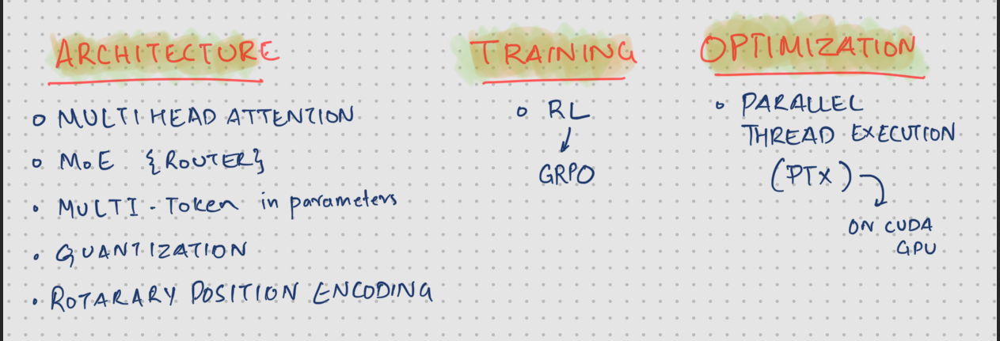

## Large Language Models
OpenAI has been at the forefront of developing sophisticated LLMs, often perceived as black boxes. 1  Until DeepSeek's open-source release, that is. Now, we have a unique opportunity to peek behind the curtain. In this series of articles, I have tried to delve into the inner workings of DeepSeek's LLMs, covering their architecture, optimization techniques. Here are some of my notes exploring their research papers.

<!-- truncate -->
---

## Background
DeepSeek has emerged as a significant disruptor in the AI industry, particularly in the realm of large language models (LLMs). It gained recognition for achieving high-level AI performance while utilizing significantly fewer computational resources compared to industry giants like OpenAI. 

DeepSeek leverages techniques like "Mixture of Experts (MoE)"  to optimize resource allocation,  innovations like Multi-Head Latent Attention (MLA) etc among many others. But the most important breakthrough was their commitment to open-source principles contributing to its rapid growth and influence. 

## Impact

DeepSeek's success has put pressure on established AI companies to reconsider their development strategies and by democratizing their AI technology, it has made these models more accessible to smaller organizations and developing nations.

They developed a model much more powerful (or similar) than OpenAI with significantly less resource. DeepSeek's rise signifies a shift towards more efficient and accessible AI, challenging the dominance of OpenAI.

## My Motivation

DeepSeek's achievement, building a powerful model with optimized resources, resonates deeply. It's a testament to human ingenuity, a reminder that constraints often spark the most innovative solutions. When faced with limitations, we have an incredible ability to find efficient, impactful pathways forward.

> *We've always defined ourselves by the ability to overcome the impossible. And we count these moments. These moments when we dare to aim higher, to break barriers, to reach for the stars, to make the unknown known. We count these moments as our proudest achievements. But we lost all that. Or perhaps we've just forgotten that we are still pioneers. And we've barely begun. And that our greatest accomplishments cannot be behind us, because our destiny lies above us.*

**Cooper, (Movie - Interstellar)**

## Components

Here are the some of the components used by DeepSeek 

> Multi-Head Latent Attention 

> Mixture of Experts (MoE)   

> Multi-Token Prediction   

> Reinforcement Learning using GRPO  

> GPU Optimization via PTX  

# Conclusion

This blog series **(converted from my research notes)** will provide a glimpse into the architecture and optimization of DeepSeek's LLMs, equipping you with a solid foundation to embark on your own LLM research. The open sourcing of LLMs is a major step in the democratization of AI. The rapid evolution of these models promises to reshape how we interact with technology. 

Enjoy your reading!

## References

[Reinforcement Learning](https://arxiv.org/pdf/2501.12948)  
[Roadmap for LLMs](https://github.com/rvbug/NLP)

