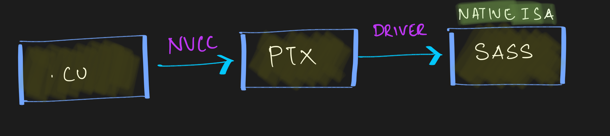

# Introduction

In my last blog, I introduced to DeepSeek and some of the components they use for R1 which is a reasoning model.

<!-- truncate -->

---

## *CPU vs GPU*
But what is the difference between a CPU and GPU? Here are some of them...

**A**> CPUs are for general-purpose computing where as GPUs are optimized for performing same operations on multuple data points simultaneously achieveing in high level of parallelism.  

**B**> CPUs are best suited which runnign complex logic where as GPUs are ideally for massively parallel computations like graphics rendering, deep learning and scientific simulations.  

**C**> CPU is optimized for low-latency access to relatively small amount of memory. GPU is typically used for high-bandwidth to large amount of dataset in parallel.

## *GPU*
Before we get into PTX, let me first give you a quick introduction to GPU, it's architecture, CUDA programming.

The cuda program workflow is as shown below. It starts off with your program which has extension of ".cu", this code can be written in C, C++ or Fortran but then there are other languages like rust which has cuda crates too.

## *Basic Flow*

This is a very basic flow of a CUDA program.

## *Detailed Workflow*

Typically these  programs has both CPU and GPU instructions running on host machine. The CPU piece of code is called the host code and GPU code section is called device code typically which has __global__ and __device__ function. 

This code is compiled using NVCC which separates both the CPU and GPU code. The CPU code uses CPU complier like GCC or MSVC which convert it to the object code. 

At the same time the 1st pass of the GPU converts the GPU code is converted to PTX code. This is a low level IR (Intermediate Representation) which is then compiled to convert it to device specific code known as  SASS code. 

Final stage is to link the host object code with SASS and run the code to run on host machine.

PTX is an abstraction layer helping code portabiloty between NVIDIA decides. This helps tools and libraries to manupulate code code before GPU execution. This is what DeepSeek team did whcih we will come back to later.

## *Structure*
Before we delve deeper into the PTX optimization by DeepSeek, let us first talk about GPU .

There are : 
1. 7 Graphic Processing Clusters (GPC) 
2. Each GPC had 12 Streaming Multiprocessors (SM). 
3. Every SM will have 4 Warps and 1 Ray Tracing core 
4. A single Warp will have 32 CUDA core and 1 Tensor Code.
5. 12 Graphic Memory Controllers
6. Two L2 Cache of 6MB SRAM each
7. NVLink
8. PCIe Interface

So in total in one NVDIA GPU there are about :

>  `10752` CUDA cores   

> `336` Tensor cores    

>  `84` Ray tracing cores  

## *Core*

Here are the three cores available in these GPUs

- CUDA Core is used for game and game engines. 
- Tensor Core is exclusively for Matrix Multiplication and Geometric Transformation which is used in AI/ML
- Ray Tracing is used ror Ray Tracing algorithms.

## Next Steps

With basic introduction to GPU and a workflow how a cuda program gets executed, let us move to PTX. See you in my next arcticle.
