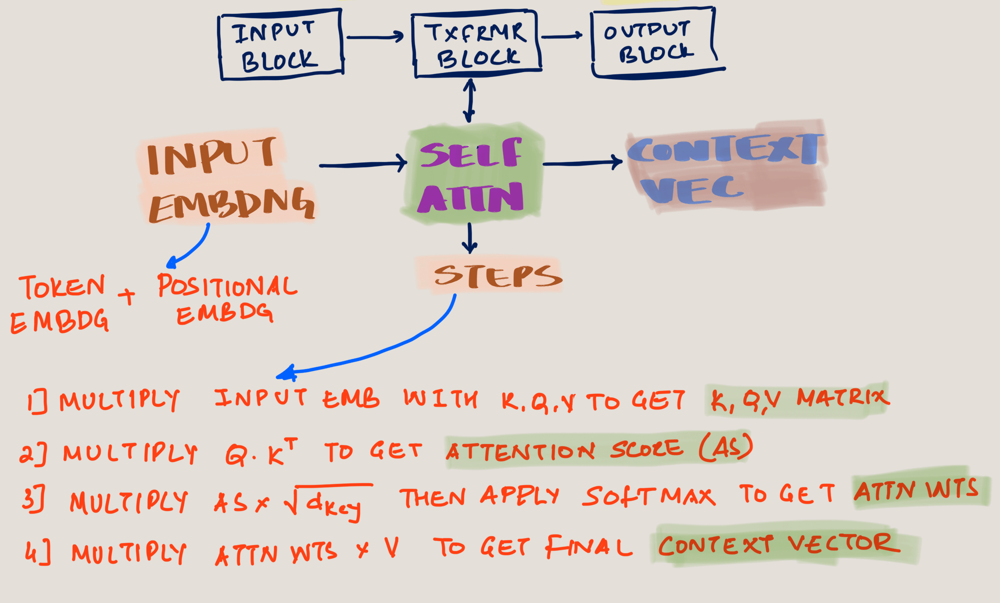

# Introduction

In my previous blog post, I introduced Deepseek LLM's innovative parallel thread execution mechanism and how DeepSeek might have use it for optimizing their GPUs. This article is about Deepseek's ground breaking innovation **Multihead Latent Attention (MHLA)** . But before we get to the concept of MLHA, we need to know what are Attention, Multihead, Causal Attention.

<!-- truncate -->

# Multihead Latent Attention Roadmap

Here's is a roadmap to understand MHLA.

# Details

At a very high level, there are three blocks as shown below. 
- The `Input Block` is where the text will be converted to a token 

Detailed workflow on how contect vector is created from inout text along with the dimensions is as below

# Attention & Self Attention

# Causal Attention

