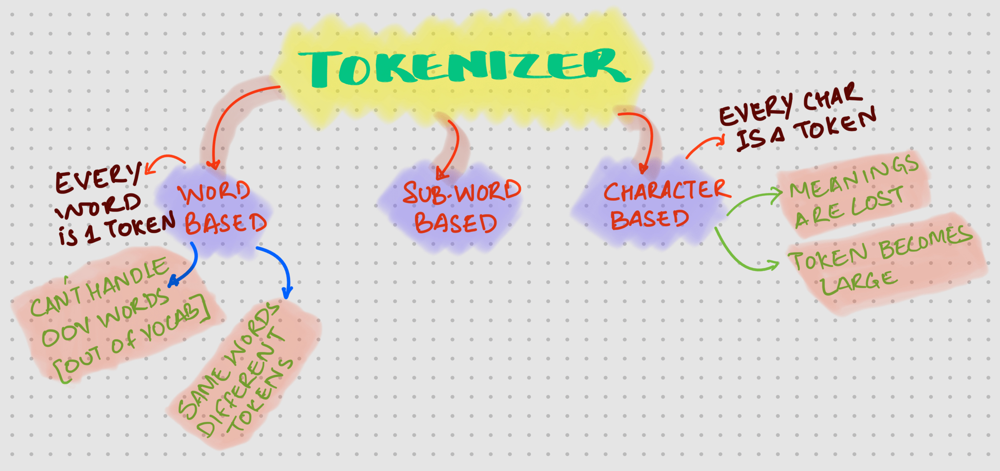

# Introduction

In building LLMs, the first step is to obtain the input text and pass it through the Tokenizer

<!-- truncate -->

# Tokenizer

Steps in Tokenization is as follows


## Types of Tokenizer

Below are three type of Tokenizers available. 




## Byte Pair Encoding (BPE)

:::note
- Orginally BPE was developed as a compression algorithm.  

- Checkout more details and the example used from [**Wiki**](https://en.wikipedia.org/wiki/Byte_pair_encoding)
:::


## Modified BPE

:::tip
In LLM, we use something called **`Modified Byte Pair Encoding`**. Used for encoding plain text to tokens
:::


## BPE Library

In Rust, you can use [Tiktoken-rs](https://docs.rs/crate/tiktoken-rs/latest) for *`BPE`*


:::info

Equivalent Python library is available 

> [Tiktoken](https://pypi.org/project/tiktoken/)

:::


## Rust Code

Below is the rust code using `Tiktoken-rs`

```rust
use tiktoken_rs::o200k_base;

fn main() {
    let bpe = o200k_base().unwrap();
    let token: Vec<u32> = bpe.encode_with_special_tokens("This is multi line sentence for BPE with rust and a sentence   with spaces");

    println!("Token: {:?}", token);
    println!("Decoding the token {:?}", bpe.decode(token));

}
```

Output of this program is as shown below

```bash
$> cargo run

## OUTPUT

#Token: [2500, 382, 12151, 2543, 21872, 395, 418, 3111, 483, 20294, 326, 261, 21872, 256, 483, 18608]
#Decoding the token Ok("This is multi line sentence for BPE with rust and a sentence   with spaces")

```

## Python Code

```python
import tiktoken
tokenizer = tiktoken.get_encoding("o200k_base")

text_data = ( "Ecode using BPE via Python")

encoder_output = tokenizer.encode(text_data, allowed_special={"<|END|>"})
print(encoder_output)


decoder_output = tokenizer.decode(encoder_output)

print(decoder_output)
```

```bash
$> python3 bpe_example.py

## OUTPUT

# [36, 3056, 2360, 418, 3111, 4493, 26534]
# Ecode using BPE via Python

```