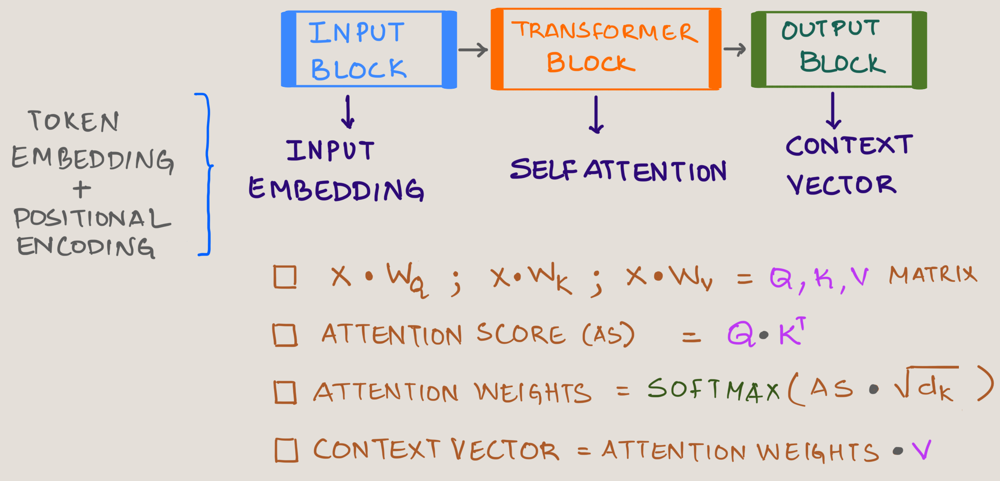
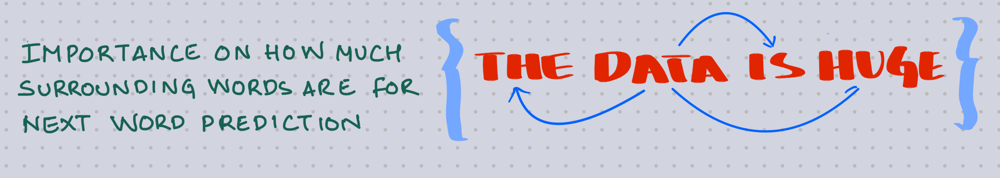

# Introduction

In my previous blog post, I introduced Deepseek LLM's innovative parallel thread execution mechanism and how DeepSeek might have use it for optimizing their GPUs. This article is about another Deepseek's ground breaking innovation **Multihead Latent Attention (MHLA)** . But before we get to the concept of MLHA, we need to know what are Attention and Multihead Attentions are.

<!-- truncate -->

# Multihead Latent Attention Roadmap

Here's is a roadmap to understand MHLA.

Attention Mechanism was introduced to solve the problem which Encoder-Decoder architecture had.

# Encoder-Decoder  

The limitation of RNN (**`Recurrent Neural Network`**) and LSTM (**`Long Short Term Memory`**) is as shown below. 

- The encoder processes input tokens sequentially through LSTM/RNN cells and the final hidden state (h3) is passed to the decoder  
- So all the information from previous hidden state (h0), (h1), (h2) and (h4 is compressed into a single vector known as contect vector  
- That means to decode, s1 will have access only to the final hidden state  
- So the conext will be lost if longer sentences are passed to the encoder   

# Drawbacks of Encoder-Decoder

The traditional encoder-decoder architecture used before attention mechanisms suffered from several key limitations:

**`Information Bottleneck`**: The entire input sequence had to be compressed into a single fixed-length context vector, regardless of the input sequence length.  
**`Long Range Dependencies`**: As sequence length increased, the model struggled to maintain relationships between positions.  
**`Vanishing Information`**: Information from the beginning of long sequences would "fade" by the time it reached the decoder.  

These limitations were particularly problematic for machine translation tasks where sentences in different languages often have different structures and word orders.

# Attention 

The concept of `Attention` was introduced to solve the above challenges in a landmark paper *`Neural Machine Translation by Jointly Learning to Align and Translate`* by Bahdanau, Cho, and Bengio in 2014. It revolutionized the field of sequence processing by allowing neural networks to focus on specific parts of the input when generating outputs. 

:::info
* Decoder (s1) has now access to every hidden state in the above image and has context of every hidden state in the encoder stage.
* See the attention weights giving the importance for each hidden state
:::

Another way of imagining the Attention Mechanism is as below. The attention block in between has the context information of inputs and much more richer containing semantic meaning.

:::info
The stronger colored bands in the attention visualization represent higher attention weights
:::

The Bahdanau attention mechanism allowed  decoder to "look back" at the entire sequence of encoder hidden states when generating each output token. Rather than relying solely on a fixed context vector, the decoder could dynamically focus on relevant parts of the input sequence.

# Self Attention 

To understand how everything fits together, take a look at the transformer archiecture again  .  

If I use `block scematic` then here's how the diagram will look like.

Where:

$ X :   $  `Input embedding (Token Embedding + Positional Encoding)`   
$ W_Q : $ `Trainable Query Matrix`    
$ W_K : $ `Trainable Key Matrix`   
$ W_V : $ `Trainable Value Matrix`       
$ \sqrt(d_k): $ `Square Root of keys dimensions`  

:::tip 
Checkout how the word `Data` tries to gather importance of it's surrounding words. 
This will be done by every word with others in the same sentence to calculate *`Attention Score`*.

:::

:::info
Check this out for better understanding...  

`Attention Score will then be calculated as :`  
$ x_2 \circ x_1 $  
$ x_2 \circ x_2 $  
$ x_2 \circ x_3 $  
$ x_2 \circ x_4 $  

`Attention Weights will be :`

 $ Attention Weight  = $ softmax $([\alpha_{21},\alpha_{22},\alpha_{23},\alpha_{24}])$ = $([w_{21},w_{22},w_{23},w_{24}])$

`Finally Context Vector for "Data" will then be :`    

$ Context Vector_{Data} = $
$ (w_{21} \circ v_1) + $ 
$ (w_{22} \circ v_2) + $ 
$ (w_{23} \circ v_3) + $ 
$ (w_{24} \circ v_4)   $ 

Where:   $v_1 ,v_1, v_1, v_1$ are Value Matrix

:::

# Self Attention - Dimensions 

Here is what happens the input text is processed via all the three blocks including a sample matrix dimension.
Once you understand this, it becomes easier to code out the enire self attention mechanism from scratch.

:::tip
You need to have a good grasp of **Tensors** (multi dimensional arrays) and **Matrix multiplication** to follow along.  
It just needs some practise - thats all!!
:::

# Code

# Disadvantage

Self attention relies on dot product which can capture the similarity but not the contextual ambiguities. Check the example below:

# Causal Attention

